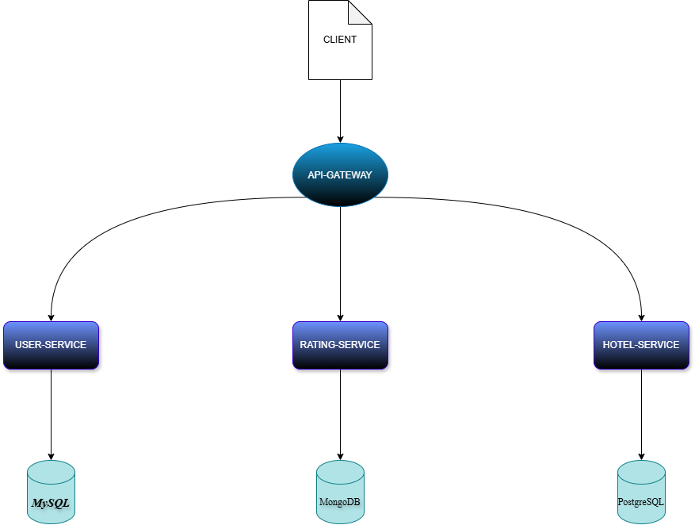
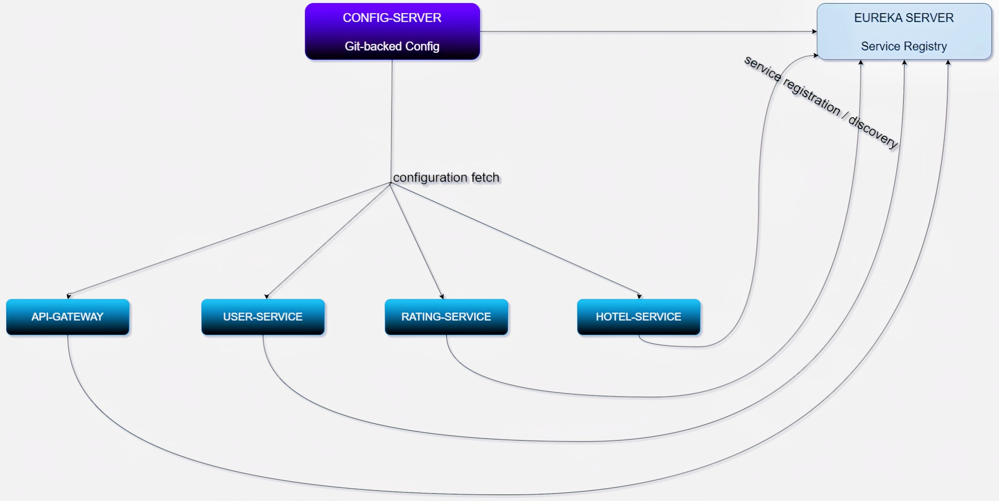
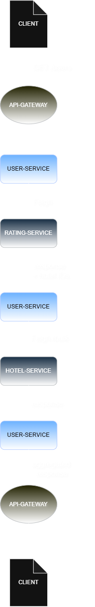
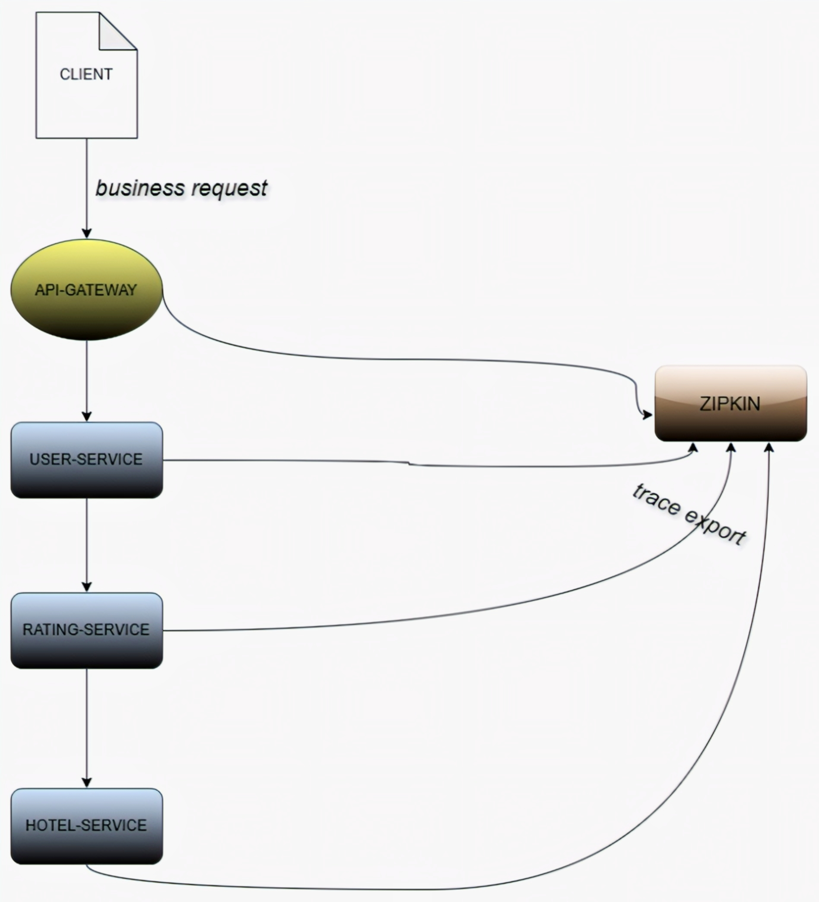
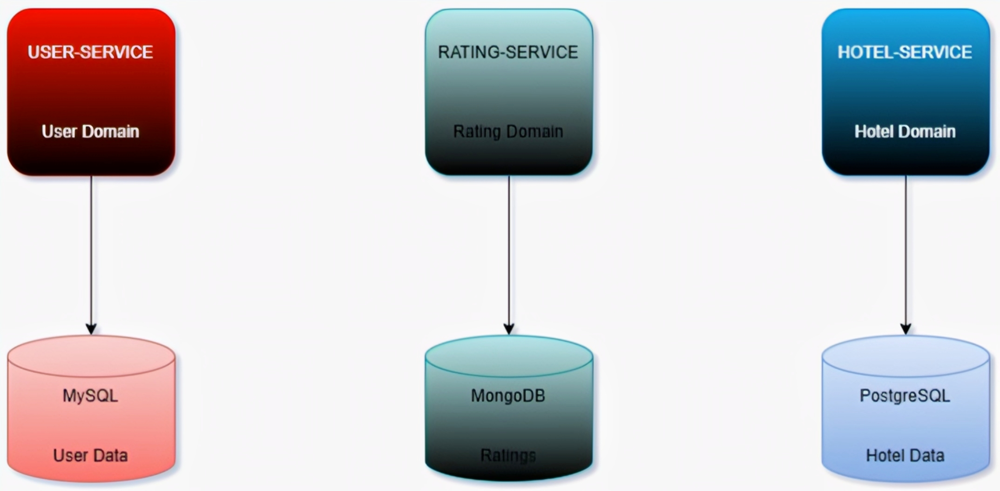

# Engineering Decisions — Hotel Review System

**Document type:** Internal architecture record
**Audience:** Backend engineers, architects, technical interviewers
**Scope:** Rationale behind every major architectural and technology decision in the Hotel Review System

**Figure 1.** Overall architecture of the Hotel Review System.



This document does not explain *how* Spring Boot, Eureka, Feign, or Resilience4j work. It explains *why* each was chosen for this system, what alternatives were rejected and why, and what was traded away in the process. Every decision is recorded using a consistent structure:

**Problem → Why Alternatives Were Insufficient → Decision → Benefits → Tradeoffs → Future Improvements**.

---

## Executive Summary

The Hotel Review System is decomposed into six deployable units: an API Gateway, a Config Server, a Eureka discovery server, and three domain services (User, Rating, Hotel). The system was built as a distributed architecture rather than a monolith specifically to exercise and demonstrate the engineering concerns that dominate real backend platform work: service boundary design, inter-service communication under failure, externalized configuration, identity propagation, and observability across process boundaries.

Each decision in this document was made against a concrete problem the system would otherwise have — not because a technology is popular. Where a simpler solution (a modular monolith, a single shared database, hardcoded service URLs) would have been sufficient for the current scale, that is stated explicitly, along with the point at which the more complex solution starts paying for itself.

The recurring theme across the decisions below is **operational trust boundaries**: which component is trusted to know what, when it is allowed to be wrong temporarily (eventual consistency, stale service registry entries, cached config), and what happens when a downstream dependency is slow or unavailable. That theme is what ties together the choice of Eureka, Feign, Resilience4j, Zipkin, and OAuth2 into a single coherent system rather than a checklist of trendy libraries.

---

## Why Microservices?

### Problem

A hotel review platform has at least three domains with different lifecycles and different scaling profiles: user identity and authentication, hotel catalog data, and review/rating submission. These domains change at different rates (catalog data is relatively static; ratings are write-heavy and bursty; user/auth logic is security-sensitive and needs isolated hardening) and are owned, in a real organization, by different teams with different release cadences.

### Why a Monolith Was Insufficient

A monolith is not wrong at small scale — it is in fact the *correct* default for a system with a single team and low request volume, because it avoids all the distributed-systems tax described below. It becomes insufficient here for specific, structural reasons:

- **Shared deployment unit.** A schema change or bug fix in the rating logic would force a redeploy of the entire application, including unrelated user-authentication code, increasing blast radius for every change.
- **Shared failure domain.** An unhandled exception, memory leak, or thread pool exhaustion in one module (e.g., a slow review-aggregation query) can degrade or crash the entire process, taking down authentication and catalog browsing along with it.
- **Uniform scaling.** A monolith scales as one unit. If rating submissions spike during a promotional event, the entire application — including the comparatively static hotel catalog — must be scaled, wasting compute on components that don't need it.
- **Team-boundary mismatch.** A monolith has no enforced ownership boundary. Module boundaries inside a single codebase are conventions, not contracts, and tend to erode under deadline pressure (an engineer working on hotel search can, without any structural barrier, reach directly into rating internals).

### Decision

Decompose the system into independently deployable services aligned to domain boundaries: **User Service** (identity, authentication-adjacent user data), **Hotel Service** (catalog), and **Rating Service** (reviews and scores), fronted by a **Gateway**, coordinated via **Eureka** for discovery and **Config Server** for configuration.

### Benefits

- **Independent deployment** — the Rating Service can ship a schema migration or a new endpoint without coordinating a release of Hotel or User Service.
- **Independent scaling** — Rating Service replicas can be scaled horizontally in response to write load without over-provisioning Hotel Service.
- **Fault isolation** — a Rating Service outage (e.g., database connection exhaustion) degrades review submission but does not, by itself, take down authentication or catalog browsing, provided the Gateway and calling services apply resilience patterns at the boundary (see Resilience4j section).
- **Enforced ownership boundaries** — a service boundary is a network boundary; it cannot be silently violated the way an in-process module boundary can.

### Tradeoffs

- **Distributed systems tax.** Every inter-service call is now a network call: it can time out, partially fail, or arrive out of order in ways an in-process method call never does.
- **Operational overhead.** Six deployable units means six sets of logs, six health checks, six deployment pipelines — versus one for a monolith.
- **Data consistency complexity.** Cross-service consistency (e.g., deleting a user and cascading to their ratings) can no longer rely on a single ACID transaction; it requires either choreography, orchestration, or acceptance of eventual consistency.
- **Local development friction.** Running the full system locally now requires standing up Eureka, Config Server, and three services instead of one Spring Boot process.

### Future Improvements

- Introduce a saga or outbox pattern for cross-service data consistency (e.g., user deletion cascading to ratings) rather than relying on synchronous Feign calls for multi-step operations.
- Formalize service-level API contracts (OpenAPI specs per service) so that boundary changes are reviewed independently of implementation.

---

## Why API Gateway?

### Problem

With three independently deployable backend services, clients (web, mobile, third-party integrators) need a single, stable entry point. Without one, every client would need to know the network location of every service, implement its own authentication logic against each service, and be updated whenever a service is added, removed, or rescaled.

### Why Alternatives Were Insufficient

- **Direct client-to-service calls** expose internal topology to the outside world, meaning any internal refactor (splitting a service, moving a host) becomes a client-facing breaking change.
- **Duplicating auth logic in every service** multiplies the attack surface and the chance of an inconsistent implementation — one service validating tokens slightly differently than another is a real security bug class, not a theoretical one.
- **A hardcoded reverse proxy (e.g., static Nginx config)** solves routing but not service discovery — it would need to be manually updated every time a service instance's location changes, which defeats the purpose of using Eureka underneath.

### Decision

Introduce a Gateway service as the single ingress point, integrated with Eureka for dynamic routing to service instances.

### Benefits

- **Centralized routing** — clients address logical service names through the Gateway; the Gateway resolves actual instance locations via Eureka, so services can be relocated, rescaled, or restarted without any client-facing change.
- **Centralized authentication enforcement point** — token validation can be enforced at the Gateway (and again at each resource server, defense-in-depth), rather than trusting every downstream service to independently implement it correctly.
- **Request filtering** — cross-cutting concerns (correlation ID injection, header normalization, request/response logging) live in one place instead of being reimplemented per service.
- **Future rate limiting** — the Gateway is the natural enforcement point for global or per-client rate limits, since it sees all inbound traffic before it fans out to services; this is a stated future improvement, not yet implemented (see Future Architecture Evolution).

### Tradeoffs

- **Single point of failure risk** — if the Gateway is down, the entire system is unreachable from the outside, even if all backend services are healthy. This is mitigated by running multiple Gateway instances, but it does introduce a component that must be highly available in a way individual services do not strictly need to be.
- **Added latency** — every request now takes an extra network hop through the Gateway before reaching a service.
- **Potential bottleneck** — the Gateway must be scaled to handle aggregate traffic across all services, not just its own logic.

### Future Improvements

- Add rate limiting (per-client and global) at the Gateway using Resilience4j's `RateLimiter` or a dedicated gateway-level filter.
- Add request/response caching for read-heavy, low-volatility routes (e.g., hotel catalog lookups).

---

## Why Eureka?

**Figure 2.** Configuration and service-discovery topology.


### Problem

In a system with multiple service instances that can scale up, scale down, restart, or be redeployed to different hosts at any time, any component that calls another service (the Gateway calling Hotel Service, Rating Service calling User Service) needs to know *where* that service currently lives — without that location being hardcoded.

### Why Alternatives Were Insufficient

- **Hardcoded URLs/IPs in configuration** work until the first time a service is rescaled, redeployed to a new host, or run with more than one instance — at which point every caller's configuration must be manually updated, and load cannot be distributed across instances without an additional layer anyway.
- **DNS-based discovery alone** (e.g., round-robin DNS) has caching and propagation delay issues that make it a poor fit for frequently changing instance sets, and lacks built-in health-based eviction.
- **A manually maintained load balancer config** reintroduces the same manual-update problem as hardcoded URLs, just moved one layer down.

### Decision

Use Eureka as the service registry: every service instance registers itself on startup and sends periodic heartbeats; callers (via the Gateway or Feign clients) resolve logical service names to live instance lists through Eureka rather than static configuration.

### Benefits

- **Dynamic service discovery** — new instances become callable automatically the moment they register, with no caller-side configuration change.
- **Avoids hardcoded URLs** — services reference each other by logical name (e.g., `hotel-service`) rather than host:port, decoupling deployment topology from code.
- **Scaling benefits** — adding replicas of a service for load distribution requires no coordination with callers; Eureka's client-side load balancing (via Feign/Ribbon-style integration) spreads requests across all registered, healthy instances automatically.
- **Self-healing registry** — instances that stop sending heartbeats are evicted, so callers naturally stop being routed to dead instances after the eviction window.

### Tradeoffs

- **Eventual consistency in the registry** — Eureka favors availability over strict consistency (AP over CP in CAP terms); a recently deregistered or crashed instance may still receive some traffic for a short window until eviction completes. This is an intentional design choice in Eureka and must be compensated for at the client (timeouts, retries, circuit breakers), not fought against.
- **Yet another component to run and monitor** — Eureka itself must be deployed, and in a naive single-instance setup becomes a single point of failure for discovery (mitigated by running a Eureka cluster in production).
- **Startup ordering sensitivity** — services depend on Eureka being reachable at startup for registration; this must be handled with retry/backoff rather than a hard failure.

### Future Improvements

- Run a multi-node Eureka cluster (peer-aware replication) for production resilience rather than a single instance.
- Evaluate a service mesh (e.g., Istio/Linkerd sidecars) as the discovery+resilience layer if the system moves to Kubernetes, where discovery is often better handled by the platform itself (see Future Architecture Evolution).

---

## Why Spring Cloud Config?

### Problem

Each service needs environment-specific configuration (database URLs, credentials references, feature flags, resilience thresholds) that differs between local development, staging, and production. Baking configuration into each service's packaged artifact means every environment change requires a rebuild and redeploy, and there is no single place to see or audit what configuration is actually running.

### Why Alternatives Were Insufficient

- **Configuration baked into `application.yml` per service, per environment** requires maintaining N environment-specific config files per service, duplicated logic for environment selection, and a rebuild for every config change — even a non-code change like a threshold tweak.
- **Environment variables set manually per deployment** work at small scale but have no version history, no audit trail, no diffing, and no rollback mechanism; a bad value set by hand in production is discovered only by its effects.
- **A shared database table for config** adds a hard dependency on database availability just to boot a service, and still lacks version control and code-review-style change auditing.

### Decision

Use Spring Cloud Config Server, backed by a Git repository, as the single source of truth for externalized configuration. Services fetch their configuration from Config Server at startup (and optionally refresh at runtime).

### Benefits

- **Externalized configuration** — configuration is fully decoupled from the deployable artifact; the same build can be promoted from staging to production with only its configuration source changing.
- **Environment separation** — profile-specific config (`application-dev.yml`, `application-prod.yml`) is resolved centrally per requesting service and active profile.
- **Centralized management** — one place to see what every service is configured with, rather than SSHing into N hosts or checking N deployment manifests.
- **Git-backed configuration** — every configuration change is a commit: it has an author, a timestamp, a diff, and a message, and can be reverted with `git revert` like any code change.

### Tradeoffs

- **Config Server becomes a startup-time dependency** for every service; if it is unreachable and a service has no cached/fallback config, that service cannot start cleanly.
- **Secrets management is not solved by this alone** — Git-backed config is not an appropriate place for raw secrets (database passwords, API keys) without additional encryption (e.g., Spring Cloud Config's encryption support or an external vault); this system treats Config Server as the source for non-secret configuration and structural settings.
- **Refresh semantics add complexity** — runtime config refresh (`@RefreshScope`) has to be explicitly wired and understood by engineers, or they will assume a config change takes effect immediately when it does not.

### Future Improvements

- Integrate a dedicated secrets manager (e.g., HashiCorp Vault) for credentials, keeping Git-backed Config Server for non-sensitive structural configuration only.
- Add Spring Cloud Bus so config refresh events can be broadcast to all instances of a service simultaneously instead of polling or manual refresh per instance.

---

## Why OpenFeign?

**Figure 3.** `/users` aggregation request flow across the services.


### Problem

Services need to call each other over HTTP (e.g., Rating Service calling User Service to validate a user before attaching a review). Writing this with a raw HTTP client means manually constructing URLs, serializing/deserializing JSON, handling HTTP status codes, and re-resolving the target service's address on every call.

### Why Alternatives Were Insufficient

- **`RestTemplate` or a raw `HttpClient`** requires hand-written boilerplate for URL construction, serialization, and error handling for every single inter-service call, and none of that boilerplate is reusable across different endpoints without building an abstraction layer — which is effectively reinventing Feign.
- **`WebClient` (reactive)** is a reasonable alternative in a reactive stack, but this system is built on the traditional Spring MVC (servlet) stack, where `WebClient` adds reactive-imperative interop overhead without a corresponding benefit, since nothing else in the request path is reactive.

### Decision

Use OpenFeign to define inter-service clients as Java interfaces with declarative HTTP method annotations; Feign integrates directly with Eureka for service resolution and with Resilience4j for fallback behavior.

### Benefits

- **Declarative REST clients** — an inter-service call is defined as an interface method with an annotation; there is no manual request-building code to review or maintain.
- **Cleaner code** — the calling service's business logic reads as a plain method call (`userClient.getUser(id)`), with the HTTP mechanics entirely hidden behind the interface.
- **Integration with service discovery** — Feign clients resolve target instances through Eureka automatically; no manual host/port configuration per client.
- **Trace propagation** — Feign integrates with the tracing instrumentation (Zipkin/Sleuth-style propagation) so that trace and span headers are forwarded automatically on outgoing calls, keeping a request's trace intact across service boundaries without manual header plumbing in every client.

### Tradeoffs

- **Interface-based abstraction can hide real network behavior** from engineers who forget that a Feign call is a network call with its own latency and failure modes — this is precisely why Feign is paired with Resilience4j rather than used bare.
- **Compile-time coupling to a contract** — if the User Service changes its response shape without a compatible contract update, Rating Service's Feign client fails at runtime, not compile time, unless contract testing is introduced.
- **Debugging obscures the HTTP layer** — because the call looks like a local method, engineers less familiar with Feign may have a harder time reasoning about timeouts, retries, and serialization errors compared to an explicit HTTP call.

### Future Improvements

- Introduce consumer-driven contract testing (e.g., Spring Cloud Contract) between services so that a breaking API change is caught in CI rather than at runtime.
- Standardize error-response deserialization across all Feign clients via a shared error decoder, rather than per-client handling.

---

## Why Resilience4j?

### Problem

Inter-service calls over the network can fail in ways in-process calls cannot: a downstream service can be slow, temporarily overloaded, or fully down. Without explicit handling, a slow or failing downstream service can exhaust the caller's thread pool (every incoming request blocks waiting on the slow dependency), causing the failure to cascade upstream — a single failing service can take down the entire system.

### Why Alternatives Were Insufficient

- **No resilience handling (bare Feign calls)** means every downstream failure or slowdown propagates directly and immediately to the caller, and repeated calls to an already-struggling service make the problem worse, not better.
- **Hystrix** is Netflix's older circuit breaker library for the same problem space, but it has been in maintenance mode with no active feature development, while Resilience4j is the actively maintained, lightweight successor built specifically for Java 8+ functional composition and integrates cleanly with Spring Boot without the additional dashboard/stream infrastructure Hystrix expected.
- **Manual try/catch with fixed retry loops** hand-rolls a weaker version of what Resilience4j provides out of the box (backoff strategies, circuit state machines, bulkheads) and is easy to get subtly wrong (e.g., retrying a non-idempotent operation, or retrying without backoff and amplifying load on an already-struggling service).

### Decision

Wrap inter-service Feign calls with Resilience4j's Circuit Breaker, Retry, and Rate Limiter modules, configured per client based on the call's idempotency and criticality.

### Benefits

- **Retry** — transient failures (a momentary blip, a single dropped connection) are retried automatically with backoff, without the caller needing custom logic, for calls known to be idempotent.
- **Circuit Breaker** — once a downstream service's failure rate crosses a threshold, the circuit opens and subsequent calls fail fast (or fall back) instead of continuing to pile up requests against a struggling dependency, giving it room to recover.
- **Rate Limiter** — protects a service from being overwhelmed by its own callers by bounding the rate of outgoing or incoming calls.
- **Failure isolation** — a struggling Rating Service, for example, does not exhaust the Gateway's thread pool or cause User Service lookups to also degrade, because the circuit breaker isolates the failure to calls targeting that specific dependency.
- **Fault tolerance** — combined, these patterns mean the system degrades a *specific capability* (e.g., "reviews cannot be submitted right now") rather than failing as a whole.

### Tradeoffs

- **Configuration complexity** — each pattern (retry count, backoff strategy, circuit breaker thresholds, half-open trial volume) needs tuning per call site; wrong thresholds either trip the breaker too aggressively (false negatives on a healthy service) or too late to actually protect anything.
- **Fallback logic must be designed deliberately** — a circuit breaker forces the question "what do we return when this dependency is unavailable?", which is a product/business decision (partial data? cached data? an error?), not just an engineering one, and must not be treated as an afterthought.
- **Masking real problems** — overly generous retry/fallback configuration can hide a genuinely broken downstream service behind an apparently-working caller, delaying detection of the real issue.

### Future Improvements

- Add Bulkhead isolation (thread pool or semaphore-based) per Feign client so that one dependency's saturation cannot exhaust shared resources used by calls to other dependencies.
- Expose Resilience4j circuit breaker state as metrics (open/closed/half-open per client) to Prometheus/Grafana (see Future Architecture Evolution) so degraded dependencies are visible on a dashboard, not just inferred from logs.

---

## Why Zipkin?

**Figure 4.** Distributed tracing flow from the Gateway through downstream services to Zipkin.


### Problem

A single user-facing request (e.g., "submit a review") can now involve calls across the Gateway, Rating Service, and User Service. When something is slow or fails, there is no way to know *where* in that chain the problem occurred just from a single service's local logs — each service only sees its own piece of the request.

### Why Alternatives Were Insufficient

- **Per-service logging alone** requires manually correlating timestamps across independent log files from different services, which is slow, error-prone, and effectively impossible once request volume is more than trivial (which log line in Rating Service's log corresponds to which log line in User Service's log, for the same logical request?).
- **No tracing at all** means diagnosing a cross-service latency problem is guesswork — an engineer must add temporary logging, reproduce the issue, and manually trace the call path by hand for every incident.

### Decision

Instrument all services with distributed tracing that propagates a trace ID and span IDs across service boundaries (via Feign call headers, as noted above), and export spans to Zipkin for visualization.

### Benefits

- **Distributed tracing** — a single logical request across the Gateway, Rating Service, and User Service is visible as one connected trace, with each service's contribution shown as a span.
- **Observability** — engineers can see the actual shape of a request's fan-out and sequencing, not just infer it from documentation or code reading.
- **Performance analysis** — the latency contributed by each individual service in a multi-hop request is directly visible, making it possible to identify which specific hop is the bottleneck rather than guessing.
- **Debugging** — when a request fails, the trace shows exactly which service and which downstream call was the point of failure, dramatically reducing time-to-diagnosis compared to correlating separate log files.

### Tradeoffs

- **Instrumentation overhead** — every service must correctly propagate trace context; a service that fails to forward headers correctly (e.g., a non-Feign HTTP call that skips the tracing interceptor) creates a broken trace with a missing segment.
- **Storage and retention cost** — trace data volume grows with request volume, and Zipkin's default in-memory or simple storage backends are not suitable for high-volume production retention without a proper backing store (e.g., Elasticsearch or Cassandra).
- **Sampling tradeoff** — tracing every single request is expensive at scale; a sampling strategy (trace X% of requests) is eventually necessary, which means not every incident will have a corresponding trace.

### Future Improvements

- Move Zipkin's storage backend from default in-memory storage to a persistent backend suitable for production retention.
- Introduce trace-based alerting (e.g., alert on p99 latency for a specific service-to-service call path) rather than only using traces for reactive debugging.

---

## Why OAuth2 Resource Server?

### Problem

Every service that exposes an API needs to know who is calling it and whether that caller is authorized — without each service independently implementing username/password validation, session management, or credential storage, which would duplicate sensitive logic across every service and multiply the security review surface.

### Why Alternatives Were Insufficient

- **Session-based authentication with a shared session store** requires every service to check a central session store on every request (introducing a hard synchronous dependency on that store for every single API call) and does not scale cleanly to non-browser clients or third-party API consumers.
- **Each service independently validating username/password against the User database** duplicates authentication logic and credential access across services, meaning a security fix or password-hashing upgrade has to be replicated and re-audited everywhere it was duplicated.
- **Custom token schemes (hand-rolled bearer tokens)** reinvent a well-understood, heavily scrutinized standard (OAuth2/JWT) with a much smaller and less-audited implementation, which is a poor tradeoff for anything security-critical.

### Decision

Use OAuth2 Resource Server support in each service (and at the Gateway) to validate JWTs issued by a central identity provider; services trust the JWT's signature and claims rather than re-authenticating the user themselves.

### Benefits

- **JWT validation** — each service validates a token's signature and claims locally (against the identity provider's published public key/JWKS), without a network round-trip to a central auth service on every request.
- **Stateless authentication** — no shared session store is required; any service instance can validate any request independently, which fits cleanly with horizontal scaling and Eureka-based dynamic instance counts.
- **Centralized identity provider** — authentication logic (credential validation, token issuance, password policy) lives in exactly one place; every resource server only needs to trust and validate tokens, not implement authentication itself.

### Tradeoffs

- **Token revocation is inherently harder** — a stateless JWT is valid until it expires; immediate revocation (e.g., on account compromise) requires additional mechanisms (short expiry plus refresh tokens, or a revocation/denylist check), which reintroduces some statefulness.
- **Clock skew and key rotation sensitivity** — JWT validation depends on synchronized clocks (for expiry checks) and correctly distributed signing keys; a key rotation that isn't propagated correctly can cause valid tokens to be rejected system-wide.
- **Claims trust boundary** — every resource server must treat the JWT's claims as the source of truth for authorization; a bug that fails to properly validate signature or issuer would allow forged tokens to be trusted uniformly across every service.

### Future Improvements

- Add short-lived access tokens with refresh token rotation to reduce the blast radius of a leaked token.
- Implement centralized token revocation checking (e.g., a fast denylist cache) for high-sensitivity operations where immediate revocation matters more than pure statelessness.

---

## Why Three Different Databases?

**Figure 5.** Service-to-database ownership boundaries.


### Problem

The three services have structurally different data shapes and access patterns: User Service needs strongly consistent, relational, transactional data (accounts, credentials-adjacent records); Hotel Service's catalog data has a well-defined relational structure but different scaling and read patterns; Rating Service's review data is less rigidly structured (variable review content, flexible attributes) and is comparatively write-heavy and less dependent on cross-record transactional integrity.

### Why a Single Shared Database Was Insufficient

- **A single shared database across all services reintroduces monolithic coupling at the data layer**, even if the application layer is split into services — a schema change for Rating Service could still require coordinating with User Service and Hotel Service if they share tables or a schema, defeating the purpose of independent deployability.
- **A single database becomes a shared bottleneck and single point of failure** for all three services simultaneously, even though their load profiles differ significantly (Rating Service's write-heavy bursts would compete for the same database resources as User Service's authentication-path reads).
- **Forcing one data model on all three domains** means either over-normalizing Rating Service's more flexible review data into rigid relational tables, or under-constraining User Service's transactional data to fit a document model — both are worse fits than choosing per-service.

### Decision

Apply the "one service, one database" principle with **polyglot persistence**: each service owns its own database, and no service accesses another service's database directly — all cross-service data access goes through the owning service's API.

- **User Service → MySQL** — chosen for strongly consistent, transactional, relational storage of user/account data where ACID guarantees on writes (e.g., account creation) matter and the schema is well-defined and stable.
- **Hotel Service → PostgreSQL** — chosen for its strong relational integrity guarantees plus richer query capabilities (e.g., advanced indexing, JSON column support for semi-structured catalog attributes) suited to hotel catalog data that is relational but benefits from more flexible querying than MySQL's simpler feature set offers.
- **Rating Service → MongoDB** — chosen for its schema flexibility, which fits review/rating data where fields can reasonably vary (optional review text, variable rating criteria, evolving review-attribute sets) without requiring a migration for every shape change, and its write-optimized model suits the write-heavy, less transaction-dependent nature of review submission.

### Benefits

- **True service autonomy** — each service can evolve its schema, choose its indexing strategy, and scale its database independently, because no other service has a dependency on its internal data model.
- **Right tool for the data shape** — each domain's data model (rigid/transactional vs. flexible/document-oriented) is matched to a database engineered for that shape, rather than forcing one engine to serve all three reasonably well and none of them optimally.
- **Failure isolation extends to the data layer** — a MongoDB performance issue in Rating Service does not degrade MySQL query performance for User Service, because they are entirely separate systems.

### Tradeoffs

- **No cross-service joins** — a query that conceptually spans domains (e.g., "hotels with an average rating above X") cannot be expressed as a single SQL join; it must be composed at the application layer across service API calls, which is slower and more complex than a native join.
- **Cross-service consistency becomes eventual, not transactional** — deleting a user and their associated ratings can no longer happen in a single database transaction; it requires either a distributed transaction pattern (generally avoided for good reason) or a saga/eventual-consistency approach with compensating actions.
- **Operational diversity cost** — the team must operate, back up, monitor, and understand three different database engines instead of one, which is a real operational and hiring/skills cost.

### Future Improvements

- Introduce an event-driven outbox pattern so that cross-service data effects (e.g., user deletion cascading to ratings) happen reliably and asynchronously rather than via synchronous Feign calls in the deletion path.
- Add a read-optimized aggregation/reporting store (e.g., a materialized view or a search index) for cross-domain queries like "top-rated hotels," rather than composing them live across services on every request.

---

## Why Git-based Configuration Repository?

### Problem

Configuration values change over time — thresholds get tuned, feature flags get toggled, new environment-specific values get added — and the team needs to know *who* changed *what*, *when*, and *why*, and be able to undo a bad change quickly.

### Why Alternatives Were Insufficient

- **Editing configuration files directly on running hosts or via a dashboard with no history** has no audit trail: a bad value discovered in production has no record of who changed it, when, or what the previous value was.
- **A plain shared file (e.g., a config file on a network share) without version control** does not support atomic, reviewable changes — two engineers editing the same file at the same time can silently overwrite each other's changes.

### Decision

Back Spring Cloud Config Server with a Git repository as the configuration source, so every configuration change is a Git commit.

### Benefits

- **Version control** — every configuration value's history is fully visible via `git log`/`git blame`, exactly like application code.
- **Rollback** — a bad configuration change is reverted with `git revert`, restoring the exact previous state, rather than manually reconstructing what the value used to be.
- **Auditability** — every change has an author, a timestamp, and (via commit message and, ideally, an associated pull request) a stated reason, satisfying audit requirements that a raw file edit cannot.
- **Environment management** — branch- or path-based conventions in the Git repository map cleanly to environment-specific profiles (dev/staging/prod), keeping environment separation explicit and reviewable rather than implicit.

### Tradeoffs

- **Git is not designed for secrets** — as noted in the Config Server section, sensitive values should not be stored in plaintext in this repository even though it is version-controlled; version control makes leaked secrets *harder* to fully purge, not easier, since history retains them.
- **Requires discipline in commit/PR practice** — the audit-trail benefit is only as good as the team's actual practice of writing meaningful commit messages and reviewing configuration changes like code changes; Git alone does not enforce this.

### Future Improvements

- Require pull-request review for any change to production configuration paths, treating config changes with the same rigor as code changes.
- Encrypt sensitive values within the Git-backed configuration using Config Server's built-in encryption support, or migrate secrets entirely to a dedicated secrets manager.

---

## Architectural Tradeoffs

A consolidated view of what this architecture costs and returns, independent of any single decision above:

**Advantages**

- Independent deployability and scaling per service, aligned to actual load and change-rate differences between domains.
- Fault isolation at both the application layer (Resilience4j) and the data layer (polyglot persistence, no shared database).
- Full request visibility across service boundaries via distributed tracing, which a monolith would not need but which this architecture requires and provides.
- Configuration and secrets-adjacent values are auditable and environment-aware from day one.

**Disadvantages**

- Meaningfully higher baseline operational surface area: six components must each be built, deployed, monitored, and kept healthy, versus one for an equivalent monolith.
- Cross-service data consistency is eventual by construction, which pushes real design work (compensating actions, idempotency, saga patterns) onto every workflow that spans service boundaries.
- Local development and onboarding remain more complex than a monolith, although Docker Compose now reduces the setup burden by providing a reproducible multi-service environment.

**Operational Complexity**

Running this system in production would require health checks, log aggregation, and metrics per service; a highly available Eureka strategy (or a platform-native discovery mechanism); and a Config Server deployment resilient enough not to become a startup-blocking single point of failure. None of this operational surface exists in a monolith.

**Deployment Complexity**

Six independently versioned deployable artifacts mean a coordinated release process (or, ideally, contract-safe independent releases) is required. In the Docker Compose environment, dependency health checks and startup conditions help enforce the required infrastructure ordering, while production deployment still requires a dedicated orchestration/release strategy.

**Learning Value**

This architecture deliberately surfaces the core problems that distinguish backend/platform engineering from application development: network partial failure, eventual consistency, identity propagation across trust boundaries, and cross-cutting observability. A monolith would not require solving any of these, which is precisely why this system was built as a set of services rather than a single deployable — the goal includes demonstrating competence with these problems, not only shipping the review feature itself.

---

## Deployment Architecture — Current State

The system is now containerized for local/integration deployment using **Docker and Docker Compose**. The Compose topology runs the six application components together with their supporting databases and Zipkin on a shared Docker network.

The current topology is:

```text
Client
  ↓
API Gateway
  ↓
User Service
  ├──→ Rating Service → MongoDB
  └──→ Hotel Service  → PostgreSQL

User Service → MySQL

Infrastructure:
Config Server
Eureka / Service Registry
Zipkin

Container orchestration:
Docker Compose
Network:
hrs-network
```

Within the Compose network, services communicate using Docker service DNS names rather than `localhost`. For example, User Service reaches MySQL through `mysql:3306`, Hotel Service reaches PostgreSQL through `postgres:5432`, and Rating Service reaches MongoDB through `mongodb:27017`.

Compose also defines health checks for the core infrastructure/database dependencies and startup dependencies for services that require them. This reduces startup-order failures, although container startup/health status is not by itself proof of complete end-to-end application correctness; the full request path still requires functional verification.

The Docker Compose configuration is intended primarily to provide a reproducible local/integration environment. Production orchestration, high availability, persistent observability storage, and CI/CD remain future concerns.

---

## Future Architecture Evolution

With Docker and Docker Compose now established, the following evolutions are the logical next steps, in rough order of leverage:

- **CI/CD** — automate build, test, image creation, and deployment per service so that independent deployability is realized consistently rather than only being theoretically possible.
- **Kubernetes** — move from Docker Compose/local orchestration to a production orchestration platform that handles scheduling, self-healing, and horizontal scaling declaratively; this would also prompt re-evaluating whether Eureka is still needed or whether Kubernetes-native service discovery (via Services/DNS) should replace it.
- **Centralized Logging** — aggregate logs from all services into a single searchable store (e.g., an ELK/EFK-style stack), which is the natural complement to distributed tracing: traces show *where* a request went, centralized logs show *what happened* at each stop, correlated by trace ID.
- **Prometheus** — collect time-series metrics per service (request rate, error rate, latency percentiles, circuit breaker state) to enable proactive alerting instead of reactive log/trace investigation after a user reports an issue.
- **Grafana** — visualize Prometheus metrics as dashboards, giving the team a real-time operational view of the system rather than only point-in-time trace/log lookups.
- **Message Queues** — introduce asynchronous, event-driven communication (e.g., Kafka or RabbitMQ) for workflows that don't need a synchronous response, such as cross-service consistency actions (see outbox pattern note above) or notification-style side effects, reducing the number of synchronous Feign call chains and their associated cascading-failure risk.
- **Caching** — add a caching layer (e.g., Redis) in front of read-heavy, low-volatility data such as hotel catalog lookups, reducing database load and improving latency for the most frequently accessed, least frequently changed data.

---
