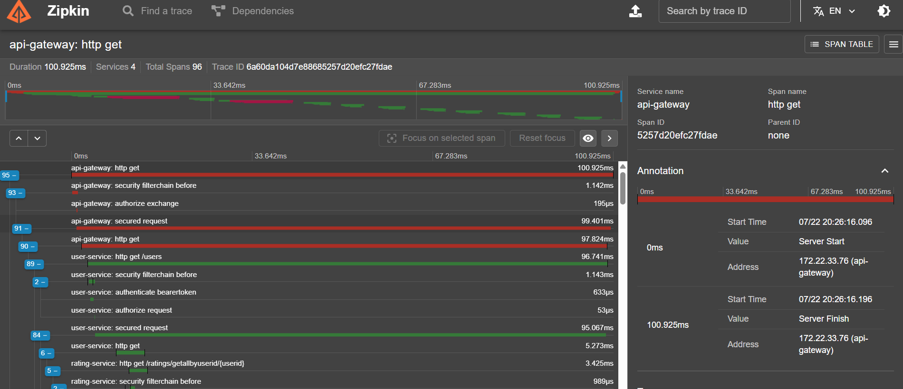
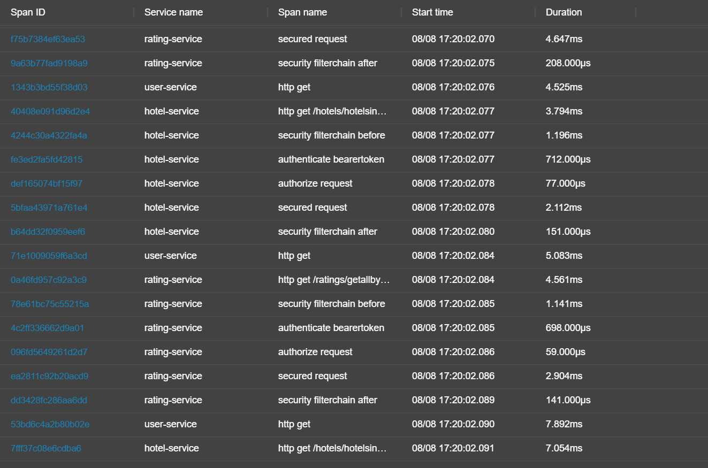

# Distributed Tracing in the Hotel Review Microservices Platform

**Location:** `docs/reports/DISTRIBUTED_TRACING.md`
**Scope:** API Gateway, Config Server, Eureka Server, User Service, Rating Service, Hotel Service
**Stack:** Spring Boot, Spring Cloud, OpenFeign, Micrometer Tracing, Brave, Zipkin, Resilience4j, OAuth2 Resource Server

---

## 1. Overview

The Hotel Review Platform uses distributed tracing to make a single client request observable across multiple independently running microservices.

A client-facing request such as `GET /users` does not execute inside one process. It enters through the API Gateway, reaches the User Service, and User Service then invokes downstream services through OpenFeign before the final response is assembled.

The tracing implementation uses:

- **Micrometer Tracing**
- **Brave**
- **Zipkin**
- **OpenFeign**
- **B3 trace-context propagation**

The goal is practical: make the request flow, per-service execution time, downstream dependencies, and (where captured) failure behaviour inspectable from a single trace, instead of reconstructing the request manually from separate service logs.

Every service participating in the request path exports its completed spans to a shared Zipkin collector. Zipkin is the tracing backend — it is **not part of the synchronous client-facing request path**.

The primary request used throughout this document for tracing analysis is:

```text
GET /users
```

---

## 2. Why Distributed Tracing

### 2.1 Problem with Distributed Logs

In a monolith, a stack trace or a sequential log file is usually enough to understand what happened, because the whole execution lives in one process with one log stream. That assumption breaks once a request crosses a network boundary.

The request path under discussion is:

```
Client
  ↓
API Gateway
  ↓
User Service
  ↓
Rating Service
  ↓
Hotel Service
```

Each hop is a separate JVM process with its own log file and its own clock, and no inherent knowledge of which inbound request it is serving relative to the others. Without a shared identifier:

- There is no way to group the log lines belonging to a single client request out of a stream containing many concurrent requests.
- Timestamps across services cannot be trusted for ordering without assuming clock synchronization, which is not a safe assumption across containers.
- A latency problem observed at the Gateway gives no indication of *where* inside the downstream chain the time was spent — network, queuing, or processing in any of the three downstream services.
- A generic 5xx at the Gateway gives no indication of which downstream service actually threw the exception, unless every service logs a sufficiently unique and greppable message.

Under concurrent traffic, manually correlating requests through timestamps and application-level identifiers becomes increasingly difficult. Retries and partial failures make the correlation even harder because a single logical request may produce activity across multiple service processes. Distributed tracing addresses this by providing a shared correlation context across the request path.

### 2.2 What Tracing Solves

A trace attaches a single identifier to every unit of work performed anywhere in the system on behalf of one client request. Once every service in the chain reports its spans under that identifier, the full execution — including which service did what, in what order, and for how long — becomes queryable as one object instead of being reconstructed from scattered logs.

---

## 3. Tracing Architecture

### 3.1 Request Flow

```
Client
  ↓
API Gateway
  ↓
User Service
  ↓
Rating Service
  ↓
Hotel Service
  ↓
Aggregated Response
```

This is the synchronous, client-facing call chain. Per the User Service implementation (`UserResilienceService.getUserWithResilience`), the call to Rating Service happens first — its response provides the hotel IDs — and the call to Hotel Service happens after, using those IDs. The source code does not use any async/parallel construct (`CompletableFuture`, reactive streams, etc.) for this pair of calls, so the two downstream calls are sequential, not concurrent.

### 3.2 Observability Flow

```
API Gateway ─────┐
User Service ────┤
Rating Service ──┼──→ Zipkin
Hotel Service ───┘
```

Every service in the call chain is instrumented with Micrometer Tracing (Brave bridge) and reports its completed spans to a shared Zipkin collector, configured via:

```yaml
management:
  zipkin:
    tracing:
      endpoint: ${ZIPKIN_ENDPOINT:http://localhost:9411/api/v2/spans}
```

Zipkin is not a synchronous application dependency in the client request chain. The services export tracing data to the configured Zipkin endpoint separately from the business request flow.

### 3.3 Components

| Component | Role |
|---|---|
| API Gateway | Entry point; OAuth2 resource-server token validation; routes to User Service via Eureka |
| Eureka Server | Service discovery used by the Gateway to resolve downstream service instances |
| User Service | Owns `GET /users`; aggregates Rating Service and Hotel Service responses |
| Rating Service | Returns ratings for a given user, called via OpenFeign |
| Hotel Service | Returns hotel details for a set of hotel IDs, called via OpenFeign |
| Config Server | Centralized configuration for the above services (not directly visible in the captured traces) |
| Micrometer Tracing + Brave | Instrumentation layer generating and propagating trace/span context |
| Zipkin | Trace storage and visualization backend |

---

## 4. Trace Context Propagation

### 4.1 Trace ID

A single identifier is generated at the point a request first enters the system (the API Gateway) and preserved unchanged across every downstream hop, so every span produced anywhere in the chain for that one client request groups under one trace in Zipkin. The captured traces confirm this — for example, Trace ID `6a60da104d7e88685257d20efc27fdae` appears against every span belonging to the 96-span trace described in §5.1.

### 4.2 Span ID

Each unit of work within a service — an inbound HTTP request, an outbound Feign call, a security-filter step — gets its own Span ID. A single service produces more than one span per request. In the captured 152-span trace, `user-service` alone contributes spans for `http get /users`, `security filterchain before`, `authenticate bearertoken`, `authorize request`, `secured request`, and the two outbound `http get` calls it makes to Rating Service and Hotel Service.

### 4.3 Parent–Child Relationships

The trace tree encodes causality: the span representing User Service's outbound Feign call to Rating Service is the **parent** of the span Rating Service creates to handle that inbound request, which is the **child**. This is what lets Zipkin render a waterfall view rather than a flat, unordered list. In the expanded 152-span trace, the selected span `user-service: http get /users` (Span ID `75164c90862a03ab`) has Parent ID `1c01a93bcd789823` — the api-gateway span that routed the request in.

### 4.4 OpenFeign + B3 Propagation

Services communicate synchronously via OpenFeign-generated HTTP clients, not a shared in-process call stack, so trace context has to survive serialization across an HTTP boundary:

- Brave's instrumentation hooks into the outbound HTTP client used by Feign and injects the current Trace ID and Span ID into outbound request headers (B3 / `X-B3-*` headers) automatically.
- On the receiving side, the same instrumentation inspects inbound headers before the controller method executes. If B3 headers are present, the receiving service joins the existing trace as a child span instead of starting a new one.
- Because this happens at the HTTP client/server instrumentation layer, none of the Feign client interfaces or controller methods in User Service, Rating Service, or Hotel Service contain tracing-specific code.

Every hop — Gateway, User Service, Rating Service, Hotel Service — includes the same tracing starter/exporter configuration. Propagation only works end-to-end if every hop is instrumented; one uninstrumented service in the chain would break the trace into disconnected pieces.

---

## 5. Runtime Trace Validation

### 5.1 Trace Evidence — 96 Spans

### Figure 1 — Zipkin Trace: 4 Services, 96 Spans



**Figure 1.** Captured Zipkin trace, Trace ID `6a60da104d7e88685257d20efc27fdae`, rooted at `api-gateway: http get`. Duration 100.925 ms across 4 services and 96 total spans.

Observed span breakdown (partial, as visible in the capture):

| Span | Service | Duration |
|---|---|---|
| `http get` (root) | api-gateway | 100.925 ms |
| `security filterchain before` | api-gateway | 1.142 ms |
| `authorize exchange` | api-gateway | 195 µs |
| `secured request` | api-gateway | 99.401 ms |
| `http get` | api-gateway | 97.824 ms |
| `http get /users` | user-service | 96.741 ms |
| `security filterchain before` | user-service | 1.143 ms |
| `authenticate bearertoken` | user-service | 633 µs |
| `authorize request` | user-service | 53 µs |
| `secured request` | user-service | 95.067 ms |
| `http get` | user-service | 5.273 ms |
| `http get /ratings/getallbyuserid/{userid}` | rating-service | 3.425 ms |
| `security filterchain before` | rating-service | 989 µs |

The root span's Server Start/Server Finish annotations show the request starting at `07/22 20:26:16.096` and completing 100.925 ms later. Every visible span in this trace corresponds to a successful step — no error or short-circuit spans appear in the captured view.

### 5.2 Trace Evidence — 152 Spans

### Figure 2 — Zipkin Trace: 4 Services, 152 Spans


**Figure 2.** Captured Zipkin trace, Trace ID `6a77183c958a183e676fa4d8f004d6b7`, rooted at `api-gateway: http get`. Duration 139.015 ms across 4 services and 152 total spans, captured on `08/08`.

Observed span breakdown (partial, as visible in the capture), with the selected span `user-service: http get /users`:

| Span | Service | Duration |
|---|---|---|
| `http get /users` | user-service | 133.130 ms |
| `security filterchain before` | user-service | 1.589 ms |
| `authenticate bearertoken` | user-service | 908 µs |
| `authorize request` | user-service | 77 µs |
| `secured request` | user-service | 130.848 ms |
| `http get` | user-service | 6.328 ms |
| `http get /ratings/getallbyuserid/{userid}` | rating-service | 3.308 ms |
| `security filterchain before` | rating-service | 1.125 ms |
| `authenticate bearertoken` | rating-service | 682 µs |
| `authorize request` | rating-service | 46 µs |
| `secured request` | rating-service | 1.757 ms |
| `security filterchain after` | rating-service | 115 µs |
| `http get` | user-service | 8.071 ms |
| `http get /hotels/hotelsinbulk/{hotelids}` | hotel-service | 5.195 ms |

The selected span's annotations show Server Start at `08/08 17:21:24.965` and Server Finish at `08/08 17:21:25.098+`, matching the reported span duration.

This trace has more spans than the one in §5.1 for the same logical endpoint. The evidence does not include a breakdown explaining the difference (e.g. number of ratings/hotels returned for the specific user in each request), so the higher span count is reported as observed, not attributed to a specific cause.

### 5.3 Span Table Analysis

### Figure 3 — Zipkin Span Table



**Figure 3.** Span-level table view (Span ID, Service name, Span name, Start time, Duration) covering `rating-service`, `hotel-service`, and `user-service` spans, timestamped `08/08 17:20:02.070`–`.091`.

This view is useful for a different reason than the waterfall views in §5.1/§5.2: it lines up the same span types — `secured request`, `security filterchain before/after`, `authenticate bearertoken`, `authorize request` — side by side across services. The table confirms that JWT authentication and authorization are executed independently in **each** service (rating-service and hotel-service both run their own `authenticate bearertoken` / `authorize request` steps), not just once at the Gateway. Durations for these security steps are consistently sub-millisecond to low-millisecond (e.g. `authenticate bearertoken` at 712 µs and 698 µs for hotel-service and rating-service respectively), while the outer `http get` / `secured request` spans account for most of the visible time.

---

## 6. GET /users — End-to-End Trace

### 6.1 Request Lifecycle

Based on the captured traces in §5.1–§5.2 and the request-handling code in `UserResilienceService`:

1. **API Gateway receives the request** and creates the root span (Trace ID origin). OAuth2 resource-server token validation happens at this layer — the `security filterchain before` / `authorize exchange` spans on `api-gateway` are visible in Figure 1.
2. **Gateway routes to User Service** via Eureka-resolved service discovery, carrying the injected B3 headers.
3. **User Service handles the inbound request** as a child span, runs its own security filter chain (`authenticate bearertoken`, `authorize request`), then loads the user and calls Rating Service.
4. **Rating Service** receives the call as a new child span, runs its own security filter chain, and returns the user's ratings.
5. **User Service extracts hotel IDs** from the returned ratings and calls Hotel Service in bulk (`/hotels/hotelsinbulk/{hotelids}` — a single bulk request rather than one call per hotel ID).
6. **User Service aggregates** the ratings and hotel data into the final `UserDto` and returns it up through the Gateway to the client.
7. **Independently of the response path** the participating services export their tracing data to the configured Zipkin endpoint.

### 6.2 Downstream Calls

Per `UserResilienceService.getUserWithResilience`, the two downstream calls are not independent — the Hotel Service call needs the hotel IDs produced by the Rating Service response:

```java
List<RatingDto> ratings = ratingClient.getRatings(userId);
Set<String> hotelIds = ratings.stream()
        .map(RatingDto::getHotelId)
        .filter(Objects::nonNull)
        .collect(Collectors.toSet());
Map<String, HotelDto> hotelMap = hotelServiceClient.fetchHotelsForIds(hotelIds);
```

This matches what both captured traces show: the `rating-service` span completes before the `hotel-service` span begins under `user-service`. Nothing in the code or the traces indicates the two downstream calls run in parallel.

### 6.3 Trace Interpretation

The two traces in §5.1 and §5.2, despite different span counts and durations, show the same structural shape: Gateway → User Service (auth) → Rating Service (auth) → Hotel Service, all under one Trace ID. That consistency — the same call graph appearing across separately captured traces — is the practical value of tracing here: it confirms the deployed system behaves the way the code implies, rather than relying on reading the code alone.

---

## 7. Failure & Resilience Tracing

The trace captures in §5 are both successful requests (HTTP 200 throughout, no error spans visible). **No trace screenshot showing a failed or short-circuited downstream call was provided as part of this evidence set.** The description below is based on the Resilience4j annotations present in the source code, not on an observed failure trace. Where the code does not specify a value (retry counts, wait durations, failure-rate thresholds), it is not stated here.

### 7.1 Hotel Service Failure

The Hotel Service call is wrapped in `HotelServiceClient.fetchHotelsForIds`:

```java
@CircuitBreaker(name = "userHotelBreaker", fallbackMethod = "userHotelFallback")
@Retry(name = "userHotelService", fallbackMethod = "userHotelFallback")
@RateLimiter(name = "userRateLimiter", fallbackMethod = "userHotelFallback")
public Map<String, HotelDto> fetchHotelsForIds(Set<String> hotelIds) {
    ...
    return hotelClient.getHotels(hotelIds);
}
```

If Hotel Service is unavailable, this call is the point of failure for that portion of the request. The circuit breaker, retry, and rate limiter names (`userHotelBreaker`, `userHotelService`, `userRateLimiter`) are defined here but their thresholds are configured elsewhere and were not included in the attached material.

### 7.2 Retry

`@Retry(name = "userHotelService", ...)` is applied to the Hotel Service call. Resilience4j's retry mechanism would reattempt a failing call according to whatever policy is bound to that name in configuration. No retry count, backoff, or interval value was provided in the attached source, so none is stated here. No trace showing multiple attempt spans for a single logical call was captured.

### 7.3 Circuit Breaker

`@CircuitBreaker(name = "userHotelBreaker", ...)` wraps the same call. A second circuit breaker, `ratingHotelBreaker`, wraps the higher-level `getUserWithResilience` method in `UserResilienceService`:

```java
@Retry(name = "ratingHotelService", fallbackMethod = "ratingHotelFallback")
@CircuitBreaker(name = "ratingHotelBreaker", fallbackMethod = "ratingHotelFallback")
public UserDto getUserWithResilience(String userId) { ... }
```

This means resilience is applied at two levels: around the Hotel Service call specifically, and around the combined Rating+Hotel aggregation logic. No sliding-window size or failure-rate threshold was provided, so breaker state transitions are not described quantitatively.

### 7.4 Fallback

Two fallback methods exist in the source:

- `HotelServiceClient.userHotelFallback` — logs the triggering exception and returns a `Map<String, HotelDto>` populated with placeholder `"Fallback Hotel"` / `"Service Down"` entries for each requested hotel ID.
- `UserResilienceService.ratingHotelFallback` — logs the exception type and message, and returns a `UserDto` built from a placeholder `User` (`userId: "fallback-id"`, `name: "John Doe"`) with an empty ratings list.

Both fallbacks return a valid, well-formed object rather than propagating the exception — the caller receives a degraded response instead of a 5xx.

### 7.5 Trace Continuity

No failure trace was captured in the provided evidence, so trace continuity under an actual Hotel Service outage is not demonstrated here. Structurally, because the fallback methods execute inside the same instrumented service methods (they are the `fallbackMethod` targets of the same annotated calls), a completed request that used a fallback would still report under the same Trace ID as the rest of the request — but this has not been directly observed in the attached traces and should be validated with a captured failure trace before being stated as confirmed behaviour.

---

## 8. Performance & Observability Findings

Tracing, load testing, and runtime investigation answer different questions here and are kept separate rather than merged into one document:

- **Load testing** (see the k6 benchmark report) answers *when* the system began to degrade under increasing VUs.
- **Distributed tracing** (§5–§6 above) answers *what work was occurring* inside a given request.
- **Runtime investigation** (this section) answers *what resource behaviour was observed* in the supporting infrastructure.

### Zipkin Heap Exhaustion

### Figure 4 — Zipkin JVM Heap Exhaustion


**Figure 4.** Zipkin container log, dated `2026-07-22T15:37:01`, showing the collector process terminating shortly after startup with `Terminating due to java.lang.OutOfMemoryError: Java heap space`.

**Observed:** the Zipkin JVM raised `OutOfMemoryError: Java heap space` and terminated on `07/22`. This is a directly logged event, not an inference.

**Correlated:** the 96-span trace in §5.1 was also captured on `07/22`. The 152-span trace in §5.2 was captured later, on `08/08`, and completed successfully.

**Inferred:** the system was capable of producing a complete, successful trace by `08/08`. What specifically changed between `07/22` and `08/08` — a configuration change, a restart, or something else — is not established by the attached evidence, and is not stated here.

**Not established by this evidence:** a direct causal link between the Zipkin OOM event and any specific client-facing `GET /users` failure. The OOM log shows Zipkin's own collector process crashing; it does not, by itself, show a client request failing because of it. Zipkin sits outside the synchronous request path (§3.2) — a Zipkin outage would stop trace collection, not necessarily the client-facing response, unless something else in the stack was also affected during the same window. Any stronger claim would require correlating this timestamp against application-level error logs or the k6 benchmark run logs from the same period, which were not part of this evidence set.

---

## 9. Engineering Lessons

- Trace correlation via a single, consistently propagated Trace ID is what actually solves the "which service is responsible" problem — not more logging or better log formatting.
- The trace tree makes the *actual* runtime call graph visible. In this project, both captured traces confirm the code-implied sequence (Gateway → User Service → Rating Service → Hotel Service) rather than revealing a divergence from it.
- Security instrumentation (JWT authentication/authorization) shows up as its own spans in every service, not just at the Gateway — visible directly in Figures 1–3, not something that had to be assumed from the code.
- Tracing and Resilience4j are complementary, but one does not substitute for the other as evidence: the annotations in §7 establish that retry/circuit-breaker/fallback *logic exists*; only a captured failure trace would establish that it *behaves* as configured under an actual outage. That capture is still missing from this evidence set.
- Observability-layer failures (Zipkin's own OOM) and application-layer failures are separate concerns that happened to be investigated together here — conflating them without corroborating evidence would overstate what the logs actually prove (§8).

---

## 10. Future Improvements

- **Capture an actual failure trace.** Re-run the Hotel Service outage scenario with Zipkin healthy and capture the resulting trace, so §7 can be rewritten from observed evidence instead of source-code inspection alone.
- **Correlate the Zipkin OOM timestamp against application logs and k6 run logs** from the same window, to determine whether any client-facing requests were actually affected during the `07/22` heap-exhaustion event.
- **Record the Resilience4j configuration values** (retry count, wait duration, circuit-breaker sliding window and failure-rate threshold) alongside the code, so tracing documentation can state expected behaviour precisely rather than qualitatively.
- **Prometheus + Grafana** — scrape service-level and JVM-level metrics (including Zipkin's own JVM) to catch heap pressure before it reaches an OOM crash, and to give aggregate visibility alongside per-request traces.
- **Centralized logging** tagged with the active Trace ID, so a trace in Zipkin can be cross-referenced directly to the log lines produced during that request — which would have made the OOM-correlation question in §8 answerable from evidence rather than left open.
- **OpenTelemetry Collector** — evaluate as a vendor-neutral ingestion point in front of Zipkin.
