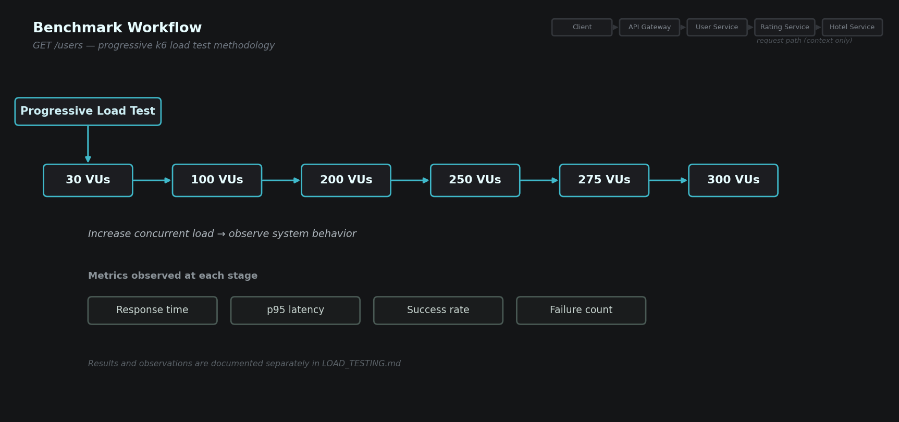
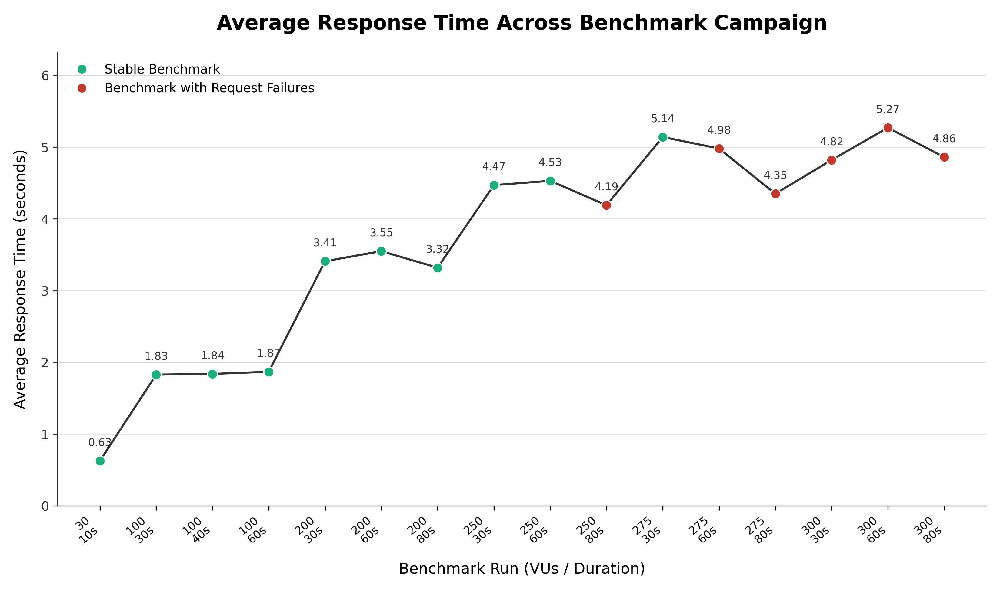
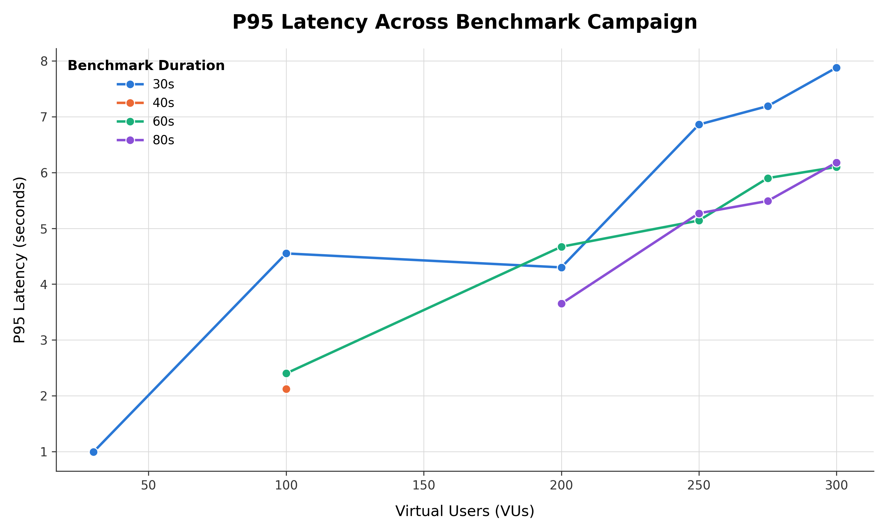
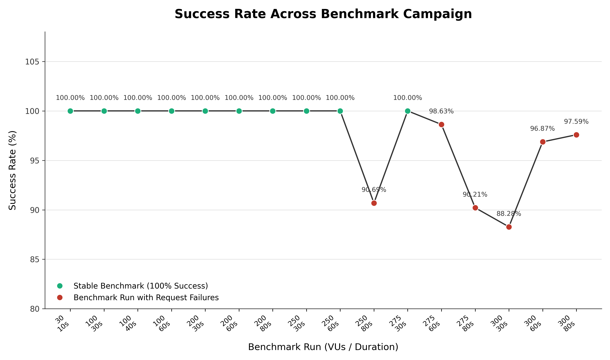
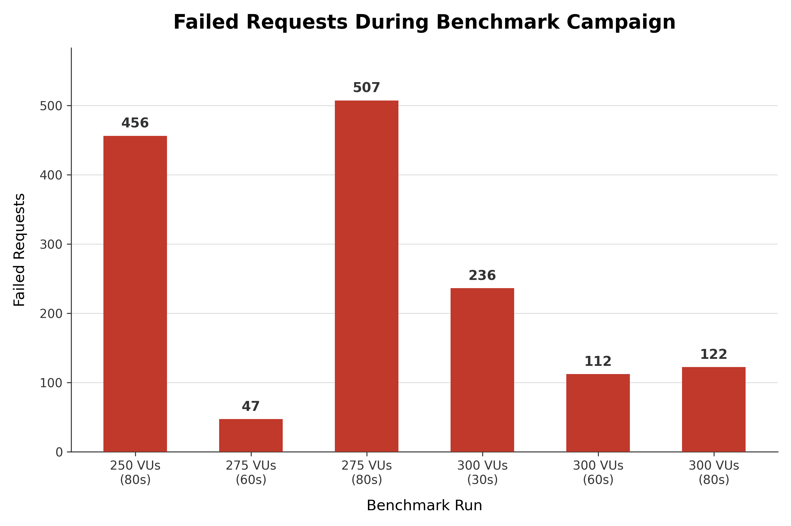
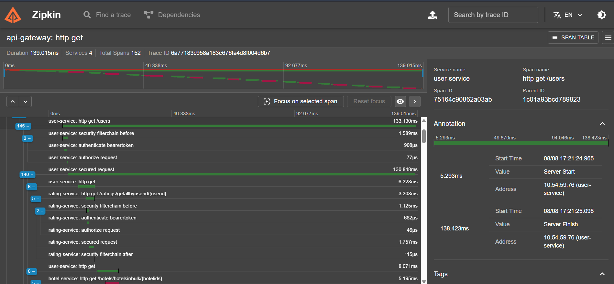
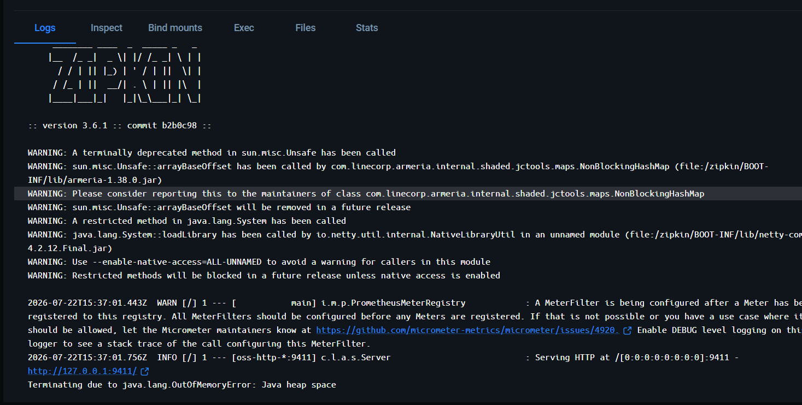

# Load Testing & Performance Validation Report

**Project:** Hotel Review System
**Document Type:** Engineering Validation Report
**Status:** Benchmark campaign completed. Runtime investigation documented with available evidence.
**Target Audience:** Backend Engineers, SREs, Technical Reviewers

---

# 1. Executive Summary

Before moving the Hotel Review System towards containerization and deployment, an incremental load-testing campaign was carried out to understand how the application behaved under increasing concurrent traffic.

Instead of jumping directly to maximum load, the benchmark gradually increased both the number of Virtual Users (VUs) and execution duration. This made it possible to observe how the system responded across multiple operating conditions and to identify the point at which measurable reliability degradation first appeared.

The campaign consisted of sixteen independent benchmark executions ranging from **30 VUs** to **300 VUs**. Each execution was treated as a separate experiment and the collected benchmark data was preserved without modification. Every numerical value referenced throughout this report originates from validated k6 benchmark results.

The purpose of this document is not to prove that the system performs well under every condition. Instead, it establishes a reliable performance baseline, documents the observed behaviour during benchmarking, and prepares the groundwork for the subsequent runtime investigation using distributed tracing and JVM diagnostics.

Where benchmark evidence was unavailable, no assumptions have been introduced.

---

## Why This Benchmark Was Performed

The Hotel Review System had reached the point where feature development alone was no longer sufficient to evaluate system quality.

Before introducing containerization and deployment, it became necessary to understand how the application behaved under concurrent client traffic and whether observable reliability degradation appeared as workload increased.

The benchmark campaign therefore served as the first engineering validation exercise rather than a deployment readiness certification.

# 2. Benchmark Scope

> The benchmark focuses on the GET /users endpoint because it exercises the longest synchronous request flow evaluated in this project. This endpoint exercises API Gateway routing, service discovery, OpenFeign communication, distributed tracing, multiple databases and JWT security in a single request.

Rather than measuring the performance of individual microservices in isolation, the benchmark evaluates the complete request path experienced by a client. Every latency measurement and success rate presented in this report therefore represents end-to-end system behaviour.

The following areas are intentionally outside the scope of this benchmark:

- Individual User Service performance
- Individual Rating Service performance
- Individual Hotel Service performance
- Database query benchmarking
- Internal network latency between services
- JVM or infrastructure resource utilisation

Those areas require additional runtime diagnostics and are addressed separately during the root-cause investigation.

---

# 3. Benchmark Objectives

The benchmark campaign was designed around five practical engineering objectives.

- Establish a measurable performance baseline before deployment.
- Determine the concurrency range in which the system consistently maintains a 100% request success rate.
- Identify the first benchmark execution that demonstrates measurable reliability degradation.
- Observe how response latency changes as both concurrency and execution duration increase.
- Produce a benchmark dataset that can later be correlated with runtime evidence such as Zipkin traces and JVM diagnostics.

An equally important objective was to avoid drawing conclusions that were not supported by evidence. For that reason, this report separates observed benchmark behaviour from any later investigation into the underlying causes.

---

# 4. Test Environment

The benchmark campaign was executed using **k6** against the Hotel Review System.

Some environmental information was not recorded during the benchmark campaign because testing was performed before deployment standardisation. Rather than reconstructing or estimating those details retrospectively, they are intentionally left undocumented until the deployment environment has been fully validated.

| Component | Description |
|-----------|-------------|
| Load Generation Tool | k6 |
| Target Application | Hotel Review System |
| Benchmark Target | API Gateway (`GET /users`) |
| Hardware Specification | To be documented after deployment validation |
| Deployment Topology | To be documented after Docker deployment |
| Network Configuration | Not documented during the benchmark campaign |
| JVM Configuration | Discussed during the runtime investigation (Section 8) |
| Database Infrastructure | Covered separately in project architecture documentation |

This approach preserves the integrity of the benchmark by avoiding assumptions about conditions that were not formally captured during testing.

---

# 5. Benchmark Methodology

The benchmark campaign was intentionally designed as a sequence of incremental validation experiments instead of a single high-concurrency stress test.

Beginning with a lower concurrency level provided a stable reference point against which subsequent executions could be compared. As concurrency increased, changes in latency and request reliability became easier to interpret because each execution introduced only a limited change in workload.

Throughout the campaign, two variables were adjusted:

- Virtual User count
- Execution duration

Every benchmark execution was performed independently and treated as its own experiment.

The campaign covered the following workload configurations:

| Virtual Users | Duration |
|--------------:|---------:|
| 30 | 10 s |
| 100 | 30 s |
| 100 | 40 s |
| 100 | 60 s |
| 200 | 30 s |
| 200 | 60 s |
| 200 | 80 s |
| 250 | 30 s |
| 250 | 60 s |
| 250 | 80 s |
| 275 | 30 s |
| 275 | 60 s |
| 275 | 80 s |
| 300 | 30 s |
| 300 | 60 s |
| 300 | 80 s |

The benchmark dataset records the following measurements where available:

- Average response time
- P95 latency
- Success percentage
- Failed request count

Other commonly reported metrics—such as P99 latency, throughput, iteration statistics and detailed request timing—were not available in the validated benchmark evidence and are therefore intentionally excluded from the analysis instead of being reconstructed.

Because each workload configuration was executed once, the benchmark should be interpreted as an engineering validation exercise rather than a statistically significant performance study. The observations recorded in the following sections describe what was measured during the campaign without attempting to infer behaviour that the available evidence cannot support.

> **Engineering Note**
>
> Each workload configuration was executed independently.
> Results from different benchmark executions were never averaged or combined when deriving observations presented in this report.

---

# 6. Benchmark Campaign

The benchmark campaign consisted of **16 independent benchmark executions**, each representing a unique combination of concurrent Virtual Users (VUs) and execution duration.

Instead of attempting to determine system capacity using a single stress test, the workload was increased incrementally. This approach made it possible to observe changes in latency and request reliability as concurrency increased while preserving a complete benchmark history for later investigation.

The table below summarizes the validated benchmark dataset collected during the campaign.
  
**Figure 1.** Complete benchmark dataset collected during the incremental load-testing campaign using k6.
| VUs | Duration | Avg Response Time | P95 Latency | Success Rate | Failed Requests |
|----:|----------|------------------:|------------:|-------------:|----------------:|
| 30 | 10 s | 630 ms | 993 ms | 100% | 0 |
| 100 | 30 s | 1.83 s | 4.55 s | 100% | 0 |
| 100 | 40 s | 1.84 s | 2.12 s | 100% | 0 |
| 100 | 60 s | 1.87 s | 2.40 s | 100% | 0 |
| 200 | 30 s | 3.41 s | 4.30 s | 100% | 0 |
| 200 | 60 s | 3.55 s | 4.67 s | 100% | 0 |
| 200 | 80 s | 3.32 s | 3.65 s | 100% | 0 |
| 250 | 30 s | 4.47 s | 6.86 s | 100% | 0 |
| 250 | 60 s | 4.53 s | 5.14 s | 100% | 0 |
| 250 | 80 s | 4.19 s | 5.27 s | 90.69% | 456 |
| 275 | 30 s | 5.14 s | 7.19 s | 100% | 0 |
| 275 | 60 s | 4.98 s | 5.90 s | 98.63% | 47 |
| 275 | 80 s | 4.35 s | 5.49 s | 90.21% | 507 |
| 300 | 30 s | 4.82 s | 7.88 s | 88.28% | 236 |
| 300 | 60 s | 5.27 s | 6.10 s | 96.87% | 112 |
| 300 | 80 s | 4.86 s | 6.18 s | 97.59% | 122 |

  
The benchmark dataset presented above forms the basis for every observation discussed in the following sections. The accompanying figures visualize the same dataset from different engineering perspectives, including response latency, reliability, and failed request behaviour.
  
**Figure 2.** Average Response Time Across Benchmark Campaign

  
**Figure 3.** P95 Latency Across Benchmark Campaign

  
**Figure 4.** Success Rate Across Benchmark Campaign

  
**Figure 5.** Failed Requests During Benchmark Campaign

  
#### All observations discussed in the following sections are derived directly from this benchmark dataset.

---

# 7. Observed Behaviour

The benchmark results summarized in Figure 2 through Figure 5 reveal several observable trends regarding latency, reliability and workload behaviour.

The objective was to understand how observable system behaviour changed as workload increased, without attempting to infer the underlying runtime causes. Any discussion regarding JVM behaviour, tracing infrastructure or resource utilisation is intentionally deferred to the runtime investigation.

---

## 7.1 Reliability Behaviour

The system recorded 100% request success throughout all tested configurations from **30** through **200** VUs(see Figure 4).

The same behaviour continued for the **250 VU** workload when executed for **30 seconds** and **60 seconds**.

The first measurable degradation appeared during the **250 VU / 80 second** execution.

From that point onward, additional failures were observed across the higher concurrency levels, although the degradation was not perfectly linear.
Instead of continuously declining as concurrency increased, reliability fluctuated across later executions, indicating that benchmark behaviour became more complex than a simple "higher load equals lower success rate" relationship.

---

## 7.2 Stability Window

Based on the available benchmark evidence, the following operating regions can be identified.

| Concurrency Range | Behaviour |
|------------------|-----------|
| 30 – 200 VUs | Stable across all tested durations |
| 250 VUs (30s & 60s) | Stable |
| 250 VUs (80s) | First measurable degradation |
| 275 – 300 VUs | Reliability degradation observed during multiple executions |

The benchmark therefore suggests that the system remained consistently stable up to **250 VUs** under shorter execution durations before measurable reliability degradation appeared.

This observation should be interpreted only within the conditions covered by the benchmark campaign and should not be treated as an absolute production capacity limit.

---

## 7.3 First Observable Reliability Boundary

The first benchmark execution that recorded failed requests occurred at:

**250 Virtual Users — 80 Seconds**

This execution produced:

- Success Rate: **90.69%**
- Failed Requests: **456**

Every execution preceding this benchmark completed without recorded request failures.

From an engineering perspective, this execution represents the first observable reliability boundary identified during the benchmark campaign.

It does **not**, by itself, identify the underlying cause of failure.

---

## 7.4 Latency Behaviour
(Figure 2 and Figure 3)

As workload increased, the benchmark generally recorded higher response latency than the baseline execution.
The initial benchmark at **30 VUs** completed with an average response time of approximately **630 ms**, while the highest average response time observed during the campaign was **5.27 seconds** during the **300 VU / 60 second** execution.

Although latency increased overall as concurrency became heavier, the progression was not strictly linear.
Within several concurrency levels, longer benchmark executions produced lower average response times than shorter executions. Similar variations were also observed in the recorded P95 latency values.

These fluctuations indicate that concurrency alone cannot fully explain the observed response time behaviour. Additional runtime conditions were likely influencing latency, but benchmark data alone is insufficient to determine their exact cause.
For this reason, latency observations presented here are treated as benchmark evidence only. Runtime investigation is discussed separately in Section 8.

---

## 7.5 Behaviour Across Concurrency Levels

The progression shown in Figure 2 demonstrates that average response time generally increased as concurrency increased, although several benchmark executions deviated from this overall trend.
Increasing the number of Virtual Users generally resulted in higher response latency and lower request reliability.

However, the relationship was not strictly proportional.

For example:

- Some 275 VU executions produced more failed requests than comparable 300 VU executions.
- The highest concurrency level did not consistently produce the worst benchmark result across every measured metric.
- Multiple benchmark executions exhibited non-monotonic behaviour, where increasing concurrency did not always produce a corresponding decrease in success rate.

These observations suggest that concurrency alone cannot fully explain the benchmark results.

Additional runtime evidence is required before any architectural conclusions can be drawn.

---

## 7.6 Behaviour Across Execution Durations
(Figure 2 and Figure 3)

Execution duration also influenced benchmark behaviour.

At both **250 VUs** and **275 VUs**, extending the benchmark from shorter durations to **80 seconds** coincided with a measurable reduction in request success.

Interestingly, the same pattern was not observed consistently at **300 VUs**.

The **300 VU / 80 second** execution achieved a higher success rate than the corresponding **30 second** execution.

Because only a single benchmark was executed for each workload configuration, this behaviour cannot be confidently attributed to any specific runtime mechanism.

Instead, it is recorded here as an engineering observation requiring further investigation.

---

## 7.7 Notable Benchmark Observations

Several benchmark executions displayed behaviour that differed noticeably from neighbouring workload configurations.

These observations were intentionally preserved because they provide valuable context for the subsequent runtime investigation.

Notable examples include:

- The **100 VU / 30 second** execution reported a significantly higher P95 latency than the corresponding 40-second execution despite nearly identical average response times.
- The **200 VU / 80 second** execution recorded a lower average response time than both shorter executions within the same concurrency level.
- The **275 VU / 80 second** execution produced the highest failed request count observed during the benchmark campaign (**507 failed requests**).
- The **300 VU / 80 second** execution achieved a higher success rate than the corresponding **300 VU / 30 second** execution despite running under a longer sustained workload.

These observations should not be interpreted as architectural conclusions. Instead, they identify benchmark executions that required additional runtime investigation using Zipkin traces and JVM diagnostics.

#### These benchmark runs were selected for deeper runtime investigation in Section 8 because they represented the largest deviations from neighbouring benchmark executions.

---

---

# 8. Runtime Investigation

The benchmark campaign established the point at which measurable reliability degradation first appeared. However, benchmark results alone cannot explain why that behaviour occurred.

To investigate the underlying cause, the benchmark data can be examined alongside runtime diagnostics from the relevant investigation period. A specific causal relationship requires matching timestamps and execution context.

The following sections document that investigation.

---

## 8.1 Investigation Strategy

Rather than immediately assuming an application-level bottleneck, the investigation followed an evidence-driven approach.

The objective was to determine whether the observed reliability degradation originated from:

- application logic,
- downstream service communication,
- infrastructure components,
- JVM resource limitations,
- or the observability stack itself.

Only findings supported by runtime evidence are included in this section.

---

## 8.2 Runtime Evidence

The benchmark campaign was later examined alongside runtime diagnostics from the system's observability infrastructure.

The available runtime evidence included:

- Zipkin trace captures
- Zipkin JVM runtime logs
- Application startup and runtime logs
- Distributed-tracing span data

These artefacts provided additional visibility into system behaviour beyond the externally observed benchmark metrics.

However, the available evidence does not establish that every benchmark failure was caused by a specific runtime event. Runtime findings are therefore reported separately from the benchmark results unless a direct temporal and causal correlation can be demonstrated.

**Figure 6.** Distributed trace captured from Zipkin during the runtime investigation.

---

## 8.3 JVM Heap Investigation

During the runtime investigation, Zipkin reported JVM heap exhaustion.

The captured Zipkin runtime log shows the collector process terminating with:

`java.lang.OutOfMemoryError: Java heap space`

This establishes that the Zipkin JVM exhausted its available heap during the observed runtime event.

The evidence does not establish that this OOM event was directly responsible for the failed requests recorded in the benchmark campaign. Zipkin is part of the observability infrastructure rather than the synchronous `GET /users` request path, so a direct causal relationship would require additional timestamp-correlated application and benchmark logs.

**Figure 7.** JVM heap exhaustion observed in the Zipkin container during the runtime investigation.

---

## 8.4 Correlation Between Benchmark and Runtime Evidence

The benchmark campaign identified the point at which request reliability began to decline.

Runtime diagnostics were then examined to identify potentially relevant system-level behaviour.

The two evidence sources answer different questions:

The benchmark answers:

> **When did externally observable degradation occur?**

The runtime investigation asks:

> **What runtime conditions were observed during the investigation period?**

A direct causal relationship between a specific runtime event and a specific benchmark failure should only be established when the timestamps and execution context can be correlated conclusively.

---

## 8.5 Engineering Validation

The benchmark campaign successfully identified the workload range where measurable reliability degradation first appeared.

The subsequent runtime investigation provided additional observability evidence, including distributed traces and a Zipkin JVM heap-exhaustion event.

These findings helped identify areas requiring further investigation, but the available evidence does not establish a single root cause for the benchmark failures.

The benchmark and runtime investigation should therefore be treated as complementary phases of the validation process.

---

# 9. Lessons Learned

Several practical lessons emerged from the benchmark campaign.

First, incremental benchmarking proved significantly more useful than immediately applying maximum load. Gradually increasing concurrency made it easier to identify the first observable reliability boundary and reduced ambiguity during later investigation.

Second, benchmark results alone were insufficient for explaining system behaviour. Runtime diagnostics, distributed tracing and JVM logs provided context that could not be obtained from latency measurements alone.

Finally, documenting what could **not** be concluded was equally important as documenting what could. Avoiding unsupported assumptions preserved the integrity of the investigation and ensured that later engineering decisions remained evidence-based.

---

# 10. Benchmark Limitations

Sixteen benchmark executions were performed during the campaign. Each execution used a predefined combination of Virtual Users (VUs) and execution duration, allowing the behaviour of the system to be observed under progressively heavier workloads while preserving every benchmark result for later comparison.

Only a single execution was performed for each workload configuration. As a result, the benchmark does not provide statistical confidence intervals or quantify run-to-run variation.

The available benchmark evidence contained Average Response Time, P95 Latency, Success Rate and Failed Request Count. Other commonly used metrics—including throughput, P99 latency, iteration statistics and detailed request timing—were not available for every execution and therefore were intentionally excluded from the analysis.

Similarly, runtime resource metrics such as CPU utilisation, JVM garbage collection behaviour, thread pool utilisation and database connection statistics were not collected during every benchmark execution.

These limitations do not invalidate the benchmark findings. Instead, they define the scope within which the observations should be interpreted.

The benchmark should therefore be interpreted as a repeatable engineering validation exercise rather than a formal capacity planning study.

Future benchmark campaigns should repeat the same workload configurations multiple times to establish statistical confidence before drawing production capacity conclusions.

---

# 11. Future Work

The benchmark campaign established an initial performance baseline for the Hotel Review System. Future work will extend this validation through additional infrastructure improvements and deployment testing.

## Immediate Priorities

- Complete Docker-based deployment validation.
- Validate benchmark behaviour after containerization.
- Document container resource allocation.

## Short-Term Improvements

- Perform timestamp-correlated analysis between benchmark executions and runtime traces when matching evidence is available.
- Record JVM memory and garbage collection metrics.
- Capture complete k6 summary reports for every benchmark execution.

## Long-Term Improvements

- Integrate Prometheus and Grafana for runtime monitoring.
- Repeat benchmark campaigns after infrastructure optimisation.
- Evaluate Kubernetes deployment and horizontal scaling strategies.

# 12. Appendix

## Appendix A — Complete Benchmark Dataset

Figure 1 contains the complete benchmark dataset collected during the load-testing campaign.

## Appendix B — k6 Benchmark Scripts

The benchmark scripts used for workload generation are available under the project's testing directory.

## Appendix C — Runtime Evidence

The runtime investigation references Zipkin traces, JVM runtime logs and application logs collected during benchmark execution.

## Appendix D — Related Documentation

- Docker Deployment Report
- Zipkin Runtime Investigation
- Architecture Documentation

---
