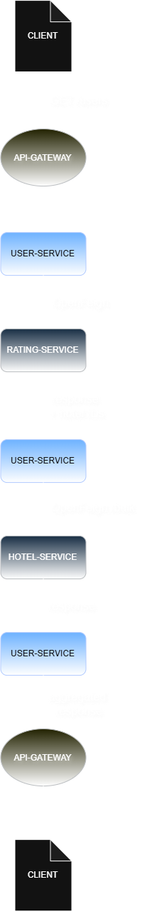

# Performance Analysis Report — Hotel Review System

**Document path:** `docs/reports/performance/PERFORMANCE_ANALYSIS.md`
**Classification:** Internal Engineering Documentation
**Audience:** Backend engineers, software architects, technical interviewers
**Scope:** Architectural/performance interpretation of runtime behaviour under normal and high-load conditions

---

## Evidence Basis

This report is the architectural interpretation layer of the project's performance work. It draws on two finalized documents and does not duplicate their content:

- **`LOAD_TESTING.md`** — the authoritative source for benchmark measurements, the k6 campaign, and the observed reliability boundary.
- **`DISTRIBUTED_TRACING.md`** — the authoritative source for trace structure, span behaviour, security-span observations, and the Zipkin runtime findings.

Claims in this report are classified, mentally and where useful explicitly, as one of: **observed/measured**, **implementation-verified** (confirmed against actual project source code), **reasonable engineering inference**, or **proposed/future work**. Where the available evidence does not establish something, this report says so rather than filling the gap with a plausible-sounding assumption.

An earlier, now-superseded `PERFORMANCE_TUNING.md` exists in the project history but is currently under review and is **not** used as a source here.

---

## Executive Summary

The Hotel Review System is a Spring Cloud-based microservices platform composed of an API Gateway, a Config Server, a Eureka discovery server, and three domain services — User Service, Rating Service, and Hotel Service — communicating synchronously over HTTP via OpenFeign.

The `GET /users` composite endpoint is the request evaluated throughout this report, consistent with `LOAD_TESTING.md` (which benchmarks this endpoint specifically) and `DISTRIBUTED_TRACING.md` (which traces it end-to-end). User Service sits at the center of a fan-out: it calls Rating Service and Hotel Service to assemble the composite response. Architecturally these are two sibling downstream dependencies of User Service, not a chain in which Rating Service calls Hotel Service. In the current implementation, however, the two calls still execute **sequentially** — not because the architecture forces a chain, but because the Hotel Service call needs the hotel IDs produced by the Rating Service response (confirmed in `UserResilienceService.getUserWithResilience` and consistent with the trace evidence in `DISTRIBUTED_TRACING.md` §6.2).

The finalized benchmark campaign (`LOAD_TESTING.md`) establishes a measured fact this report treats as ground truth: the system held 100% request success from 30 through 250 VUs at shorter durations, with the **first observed reliability degradation at 250 VUs / 80 seconds (90.69% success, 456 failed requests)**, and non-monotonic behaviour at higher concurrency. That report explicitly does not establish a root cause for the degradation. This document does not attempt to supply one either — it discusses the architectural factors (sequential aggregation, blocking I/O, per-hop serialization, security processing, tracing overhead) that are plausible contributors, without claiming any of them is the proven cause of the measured failures.

Similarly, `DISTRIBUTED_TRACING.md` documents a Zipkin JVM heap-exhaustion event and explicitly states that this observation does not, by itself, establish that it caused any specific `GET /users` failure. This report preserves that distinction rather than treating the OOM event as an explanation for the benchmark results.

---

## Architecture Impact on Performance

**Figure 1.** End-to-end service request flow for the composite `GET /users` operation.



User Service depends on Rating Service and Hotel Service as two sibling downstream services, not as a linear chain. Rating Service does not call Hotel Service. As detailed in the Request Lifecycle section below, the *order* in which User Service calls them is currently sequential — a consequence of a data dependency in the aggregation logic, not of the topology itself.

### Service Discovery

Eureka decouples physical service location from logical service identity, which is essential for elastic deployments but is not free. The project uses **Spring Cloud LoadBalancer** as the client-side load-balancing layer over Eureka's registry (not Ribbon, which is not part of the current implementation). Every Feign-initiated call is preceded by a discovery-client lookup: resolving a logical service ID (e.g. `RATING-SERVICE`) to a concrete host:port pair. Spring Cloud LoadBalancer caches the Eureka registry client-side and refreshes it on an interval, so in steady state this resolution is a local cache hit rather than a network round-trip to Eureka on every call. The performance cost is therefore not per-request network I/O to Eureka, but:

- **Registry staleness window** — instances that have gone down are not immediately removed from the client-side cache, creating a risk of routing to a dead or draining instance until the next heartbeat-driven eviction.
- **Cold-start cost** — the first calls after a service restart, or after a cache refresh, pay a synchronization cost against the registry.
- **Client-side load-balancing overhead** — selecting an instance from the cached list is a small, constant per-call cost compared to a hardcoded endpoint.

### Network Communication

Every hop in this architecture — Gateway → User Service, User Service → Rating Service, User Service → Hotel Service — is a real network call, not an in-process method invocation. Each hop incurs:

- TCP connection establishment or reuse (connection pooling matters significantly here — Feign's underlying HTTP client configuration determines whether connections are pooled and kept alive or re-established per call).
- TLS handshake cost, if TLS is terminated at each hop rather than only at the edge.
- Serialization on the sending side and deserialization on the receiving side (discussed in detail below).
- Queuing delay if the receiving service's thread pool or connection pool is saturated.

This is the fundamental cost of a distributed architecture: what would be a single stack-local call in a monolith becomes independent network transactions, each with its own failure mode, timeout, and latency distribution.

### Request Aggregation

The composite `GET /users` flow requires User Service to aggregate data that is not owned by it — ratings and hotel data live in other services' datastores. This is a deliberate architectural tradeoff (data ownership and service autonomy) that shifts aggregation logic out of the database layer (where a SQL JOIN would have handled it in a monolith) and into the application layer.

### Distributed Architecture Overhead

Beyond the individual hop costs, the system carries structural overhead inherent to any distributed topology:

- **Correlation and tracing overhead.** Every hop is instrumented with Micrometer Tracing/Brave, which adds header propagation and span-creation cost to each request. `DISTRIBUTED_TRACING.md` confirms this instrumentation is present at every service and that each service additionally runs its own security filter-chain spans (`authenticate bearertoken`, `authorize request`, `secured request`) — meaning JWT validation work, not just tracing bookkeeping, is repeated per hop. Neither report has a measured figure for the fixed cost of tracing instrumentation itself in isolation; it is discussed qualitatively here as a real but unquantified per-request cost, not as an established contributor to the benchmark degradation.
- **Config Server dependency.** Services fetch configuration at startup (and potentially on refresh events), which introduces a dependency that, if slow or unavailable, delays service readiness.
- **Resilience4j overhead.** The project's Resilience4j usage, confirmed in `HotelServiceClient.java` and `UserResilienceService.java`, is `@CircuitBreaker`, `@Retry`, and `@RateLimiter` — not `@Bulkhead`, which is not present in the reviewed source. These wrap the relevant remote calls with bookkeeping (sliding-window state updates, permit acquisition) that is small per-call but non-zero, and is the price paid for fault isolation.

---

## Request Lifecycle Analysis

This section traces a single `GET /users` request end-to-end, consistent with the request lifecycle documented in `DISTRIBUTED_TRACING.md` §6.1.

1. **Client → API Gateway.** The Gateway receives the HTTP request, performs OAuth2 resource-server token validation, and resolves the target service via Eureka-backed service discovery. A trace root span opens here.
2. **Gateway → User Service.** The Gateway forwards the request to a resolved User Service instance. User Service runs its own security filter chain (`authenticate bearertoken`, `authorize request` — observed as distinct spans in the captured traces) before handling the request.
3. **User Service → Rating Service (via OpenFeign).** User Service calls Rating Service to fetch the user's ratings. This is a Feign-declared client call, blocking the calling thread until it returns (synchronous OpenFeign, no reactive/async wrapping in the reviewed code).
4. **Rating Service internal processing.** Rating Service runs its own security filter chain and queries its datastore, then returns the ratings.
5. **User Service → Hotel Service (via OpenFeign).** Once ratings are returned, User Service extracts the relevant hotel IDs from the ratings response and issues a second Feign call — to Hotel Service, not from Rating Service — resolving hotel metadata for those IDs in a single bulk call (`/hotels/hotelsinbulk/{hotelids}`, per `DISTRIBUTED_TRACING.md` §6.1). **This call currently starts only after step 3–4 completes**, because it depends on data the Rating Service call produced — this is a data-dependency constraint in the current implementation, not an architectural requirement that Hotel Service be reached through Rating Service.
6. **Aggregation.** User Service holds its own user record plus the rating and hotel data fragments and assembles the composite response object.
7. **Response path.** The composite object is serialized to JSON and returned through the Gateway to the client. Independently of the response path, each service exports its completed spans to the configured Zipkin endpoint (`DISTRIBUTED_TRACING.md` §3.2) — this export is not part of the synchronous request path.

### Cumulative Latency (Architectural Model)

Because steps 3 and 5 execute sequentially rather than concurrently in the current implementation, total downstream latency can be modeled conceptually as:

```
Total ≈ Gateway_overhead
      + (Network_out + User_DB_query + Serialize)
      + (Network_out + Rating_Discovery + Rating_DB_query + Serialize + Deserialize)
      + (Network_out + Hotel_Discovery + Hotel_DB_query + Serialize + Deserialize)
      + Aggregation
      + Response_serialize
```

This is presented as an architectural model, not a measured equation — no per-hop latency breakdown (e.g. how much of end-to-end latency is discovery vs. database vs. serialization) is available in the current evidence set. `LOAD_TESTING.md` measures end-to-end latency for the whole request (average and P95) but does not decompose it by hop. Every term in this model is on the critical path given the current sequential execution; there is no branch of the computation that currently overlaps with another.

---

## Service Communication Analysis

### OpenFeign, Discovery, and Resilience — Separated Responsibilities

These three concerns are implemented by distinct mechanisms in this project and are kept separate here rather than described as one bundled capability:

- **OpenFeign** provides a declarative HTTP client abstraction: a Java interface annotated with routes, from which Feign generates a proxy that performs the actual HTTP call. This reduces boilerplate versus hand-rolled `RestTemplate`/`HttpClient` usage, but OpenFeign itself is only the client abstraction — it does not, by itself, provide service discovery or fault tolerance.
- **Eureka / Spring Cloud LoadBalancer** provides service discovery and client-side load balancing, resolving the logical service name a Feign client targets to a concrete instance.
- **Resilience4j** provides the fault-tolerance behaviour, and it is applied explicitly via annotations on specific service-layer methods, not automatically by Feign. Confirmed in the reviewed source:
  - `HotelServiceClient.fetchHotelsForIds` — `@CircuitBreaker(name = "userHotelBreaker")`, `@Retry(name = "userHotelService")`, `@RateLimiter(name = "userRateLimiter")`, all falling back to `userHotelFallback`.
  - `UserResilienceService.getUserWithResilience` — `@Retry(name = "ratingHotelService")`, `@CircuitBreaker(name = "ratingHotelBreaker")`, falling back to `ratingHotelFallback`. This wraps the combined Rating+Hotel aggregation logic, meaning resilience is applied at two levels: around the Hotel Service call specifically, and around the whole aggregation method.

The performance-relevant characteristic of Feign in this system is that, absent explicit async wrapping, **it is a blocking client**: the calling thread is occupied for the full duration of the remote call. At low concurrency this is inconsequential. At higher concurrency, sustained thread occupancy across many in-flight sequential requests is an architectural risk worth tracking (see Sequential Aggregation Analysis below) — this report does not claim thread-pool exhaustion was observed, since no thread-pool metrics were captured during the benchmark campaign (`LOAD_TESTING.md` §10, Benchmark Limitations).

### Network Latency

Each Feign call is subject to the physical and virtual network path between services. Connection reuse (via a configured connection pool in the underlying HTTP client) substantially reduces the per-call cost of TCP/TLS setup; without pooling, every Feign call pays full connection-establishment cost. No connection-pool configuration details were available for review, so this is discussed as a general characteristic of the pattern rather than a project-specific measurement.

### Serialization / Deserialization

Every service boundary crossing requires converting an in-memory Java object to JSON (serialization) and back (deserialization), typically via Jackson — CPU-bound work that scales with payload size and object graph complexity. In a composite request touching three services, this happens multiple times per direction per hop before the client receives a response, with no equivalent cost in a monolithic in-process call.

### Database Access

The system follows a database-per-service pattern. `application-dev.yml` for User Service confirms a MySQL datasource (`driver-class-name: com.mysql.cj.jdbc.Driver`). The specific datastore technologies used by Rating Service and Hotel Service were not part of the evidence reviewed for this report and are not asserted here; whatever they are, the architectural point holds regardless of the specific engine: because each service owns its data exclusively, there is no cross-service JOIN possible at the database layer, which is why aggregation must happen in application code as described above.

### Remote Service Calls

Taken together, the recurring unit of cost in this system is: **network call → discovery resolution → connection acquisition → serialize → transmit → receive → deserialize → process → serialize response → transmit → receive → deserialize**, repeated per hop. Under the current implementation this cost is paid sequentially for the Rating Service and Hotel Service calls, per request.

---

## Sequential Aggregation Analysis

The `GET /users` composite flow calls Rating Service and then Hotel Service **in sequence** in the current implementation — not because User Service's dependency on them is architecturally a chain (it is a fan-out, as shown above), but because the Hotel Service call needs hotel IDs that only exist after the Rating Service call returns.

### Why Sequential Execution Increases Response Time

When calls execute sequentially, total response time is approximately the **sum** of each call's latency:

```
T_total ≈ T_rating + T_hotel  (+ fixed overhead)
```

If Hotel Service's inputs did not depend on Rating Service's output, the two calls could instead be issued concurrently, making total response time bounded by roughly the **slower** of the two calls rather than their sum:

```
T_total ≈ max(T_rating, T_hotel)  (+ fixed overhead)
```

This second model is not directly applicable to the system as currently implemented, because the data dependency is real — see Parallel Aggregation in the Optimization Discussion below for what would actually be required to realize it.

### How Latency Accumulates

Every additional sequential dependency adds directly to the critical path under the current design:

- Adding a new downstream service to enrich the composite response would directly worsen `GET /users` latency under the current sequential model, all else equal.
- A slow or degraded downstream dependency doesn't just affect its own response time — it delays every subsequent call in the chain and, by extension, the entire request.
- Sequential dependencies allow a downstream outlier to accumulate directly into end-to-end latency: a slow call in *any* hop delays the whole chain, rather than being masked by a faster parallel call. This is a directional statement about how tail latency behaves in a sequential chain, not a claim that end-to-end P99 equals or exceeds the sum of individual P99 values — that stronger claim is not established by the available evidence and is not made here.

### Scalability Implications (Architectural Risk, Not an Observed Incident)

Under sequential aggregation, each in-flight composite request occupies a User Service request-handling thread for the duration of the sequential chain. This represents an architectural risk — prolonged blocking, increased thread occupancy, and concurrency amplification under load — rather than a proven bottleneck. **No thread-pool metrics, thread-dump evidence, or JVM diagnostics establishing actual thread-pool saturation were part of the benchmark or tracing evidence reviewed.** `LOAD_TESTING.md` explicitly notes that runtime resource metrics such as thread-pool utilization were not collected during the campaign (§10). This report therefore names thread-pool saturation as a plausible risk under the current design, not as an observed cause of the measured reliability degradation at 250 VUs / 80s and above.

---

## Bottleneck Analysis

The following are architecturally-plausible bottleneck candidates. Consistent with `LOAD_TESTING.md`, no root cause is asserted for the measured degradation; each item below is described in terms of *why* it is a plausible contributor and *under what condition* it would become dominant, not as a proven explanation.

- **Sequential downstream aggregation.** As detailed above, this is the primary structural candidate: it is the cost most directly tied to the number of downstream calls User Service must make in sequence, and — unlike per-hop network or database latency — cannot be mitigated by scaling any single component. Addressing it requires either an architectural change (redesigning the data contract so the calls no longer depend on each other) or accepting the sequential cost.

- **Database latency.** Each service's database is a potential contention point under its own load profile. Because databases are not shared, one service's database being slow does not directly degrade another's, but it does degrade any composite flow that depends on that service. No database-level metrics (query time, connection-pool exhaustion) were part of the reviewed evidence.

- **Network overhead.** Becomes more significant as request volume grows and connection pools are under-provisioned. No connection-pool configuration was available for review.

- **Service discovery.** Registry lookups are largely cached client-side via Spring Cloud LoadBalancer and thus low-cost in steady state, but the registry *staleness window* around instance failure/removal is a reliability concern that can surface as latency spikes (timeouts against dead instances) rather than steady elevated latency.

- **OpenFeign communication.** The blocking nature of the client means thread-occupancy risk (see Sequential Aggregation Analysis) becomes the relevant concern under concurrent load, more than the per-call overhead of Feign itself.

- **Distributed tracing (Zipkin).** Span creation and header propagation add some per-request cost, not measured in isolation here. Separately, `DISTRIBUTED_TRACING.md` documents a Zipkin JVM heap-exhaustion event (`OutOfMemoryError: Java heap space`) observed during runtime investigation, dated `07/22`. That report is explicit that this observation does not establish Zipkin OOM as the cause of any specific client-facing failure, since Zipkin sits outside the synchronous request path — it is a reporting sink, not a call the request chain blocks on. `LOAD_TESTING.md` treats the same event the same way: as a runtime-investigation finding correlated in time with the benchmark campaign, not a proven cause of the 250 VU / 80s degradation. This report preserves that distinction rather than resolving it.

<!-- IMAGE: Bottleneck contribution breakdown (relative share of total latency by component) — requires per-hop profiling data not currently available -->

---

## Engineering Tradeoffs

### Advantages of the Current Design

- Clear separation of concerns: each domain service owns its data and business logic independently.
- A complete, realistic microservices toolchain is present and integrated: discovery, gateway routing, centralized config, declarative HTTP clients, circuit breaking/retry/rate limiting, and distributed tracing.
- Database-per-service allows each service to choose the datastore best matched to its access pattern.
- Resilience4j integration (confirmed `@CircuitBreaker`, `@Retry`, `@RateLimiter` — see Service Communication Analysis) provides fault isolation for the Hotel Service call and the combined aggregation path, preventing a downstream failure from directly propagating as an unhandled exception. It does not remove the latency cost of sequential calls when both services are healthy.

### Disadvantages

- Sequential execution of the Rating and Hotel Service calls is a genuine architectural constraint, as detailed above, driven by a data dependency rather than the topology itself.
- Distributed architecture introduces partial-failure modes (a downstream service can be slow or down) that a monolith does not have to reason about.
- Operational surface area is larger: multiple datastores, a discovery server, a config server, and a tracing collector all need to be run, monitored, and kept available — and the tracing collector itself is not immune to resource exhaustion, as observed in the Zipkin OOM event.

### Maintainability

The declarative style (Feign interfaces, annotation-driven resilience policies) keeps individual services readable and testable in isolation. Aggregation logic living in User Service creates a soft coupling: User Service must know about Rating and Hotel Service response shapes, and specifically about which ratings fields feed into the Hotel Service request — a maintenance cost every time those services evolve their contracts.

### Scalability

Each service can, in principle, be scaled independently and horizontally (multiple instances registered with Eureka, load-balanced by Spring Cloud LoadBalancer). As established above, the sequential execution of Rating and Hotel calls is a risk to the *effective* benefit of horizontally scaling User Service alone, since instance capacity is partly consumed by threads blocked on the sequential downstream chain — this is presented as an architectural risk, consistent with the caveats in Sequential Aggregation Analysis, not as a measured capacity ceiling.

### Reliability

Resilience4j circuit breakers are configured to prevent unbounded blocking on a failing Hotel Service call (`userHotelBreaker`) and on the broader aggregation path (`ratingHotelBreaker`), with defined fallback methods for both. `DISTRIBUTED_TRACING.md` §7 notes that no failure-path trace was captured to confirm this behaviour end-to-end under an actual outage — the mechanism is implementation-verified in source code, but its runtime behaviour under failure is not yet directly observed in the available evidence.

### Complexity

The system carries the inherent complexity tax of distributed systems: more moving parts, more failure modes, more operational tooling (tracing, discovery, config management) than an equivalent monolith would need for the same business problem.

---

## Optimization Discussion

For each candidate optimization, current state, proposed change, expected benefit, tradeoff, and evidence status are stated separately. None of these are claimed to have measured performance benefit unless explicitly noted.

### Parallel Aggregation (Conditional)

- **Current state.** Rating Service and Hotel Service are called sequentially by User Service, because the Hotel Service call depends on hotel IDs extracted from the Rating Service response (implementation-verified in `UserResilienceService.getUserWithResilience`).
- **Proposed change.** Issue the two calls concurrently. This is **not** a drop-in change given the current data dependency — it requires redesigning the data contract so Hotel Service can be called with inputs that do not depend on the Rating Service response (for example, restructuring what identifies "the hotels relevant to this user" so it is not derived solely from the ratings call), or restructuring the aggregation to fetch ratings and a broader hotel set independently and reconcile them after both return.
- **Expected benefit.** If the data dependency is removed, total downstream latency would be bounded by the slower of the two calls rather than their sum (see Sequential Aggregation Analysis).
- **Tradeoff.** Requires an architectural/data-contract change, not just a code-level concurrency wrapper; increases the complexity of reconciling two independently-fetched results and of error handling when only one of the two calls fails.
- **Evidence status.** Proposed / future work. No implementation of this exists in the reviewed source, and no benchmark evidence of its effect exists.

### CompletableFuture

- **Current state.** Not used for the Rating/Hotel calls in the reviewed source; both are direct synchronous Feign invocations.
- **Proposed change.** If and where downstream calls are made independent (see Parallel Aggregation above), wrap each Feign call in `CompletableFuture.supplyAsync(...)` backed by a dedicated, bounded executor — not the common `ForkJoinPool`, which is shared with unrelated application work and has no natural sizing relationship to this workload.
- **Expected benefit.** A low-risk, incremental way to achieve concurrent execution within the existing synchronous Spring MVC + Feign stack, without a framework migration.
- **Tradeoff.** Introduces executor sizing/tuning as a new operational concern; still blocking under the hood, just concurrently blocking rather than sequentially blocking.
- **Evidence status.** Proposed / future work.

### Bounded Executors

- **Current state.** No explicit bounded executor for downstream calls was identified in the reviewed source.
- **Proposed change.** Introduce an explicitly sized thread pool for any async downstream work, sized against expected concurrent request volume rather than left as a framework default.
- **Expected benefit.** Predictable, capped thread usage under load, avoiding uncontrolled thread growth.
- **Tradeoff.** Requires capacity planning input this report does not have (no thread-pool metrics were captured in the benchmark campaign, per `LOAD_TESTING.md` §10).
- **Evidence status.** Proposed / future work.

### Virtual Threads (Project Loom / JDK 21+)

- **Current state.** Not used in the reviewed source.
- **Proposed change.** Run blocking Feign calls on virtual threads instead of platform threads, which would reduce the cost of thread occupancy under high concurrency for the sequential-blocking pattern that exists today, without requiring a rewrite to a reactive style.
- **Expected benefit.** Would raise the concurrency level at which thread occupancy becomes a constraint, per general JDK virtual-thread behaviour.
- **Tradeoff.** Depends on JDK version and library compatibility (e.g. blocking calls that pin the underlying carrier thread would limit the benefit); not evaluated against this codebase.
- **Evidence status.** Proposed / future work. No project-specific measurement exists.

### Caching

- **Current state.** No caching layer in front of the Rating or Hotel Service calls was identified in the reviewed source.
- **Proposed change.** Cache Rating/Hotel lookups (e.g. via Redis or Spring's `@Cacheable`) for data that changes infrequently relative to read frequency.
- **Expected benefit.** Removes repeat network round-trips for cache-hit cases.
- **Tradeoff.** Introduces cache-invalidation complexity and a staleness window.
- **Evidence status.** Proposed / future work.

### Reducing Unnecessary Remote Calls / Bulk APIs

- **Current state.** The Hotel Service call is already a single bulk request (`/hotels/hotelsinbulk/{hotelids}`) rather than one call per hotel ID, per `DISTRIBUTED_TRACING.md` §6.1 — this is implementation-verified, not proposed.
- **Proposed change.** If `GET /users` is extended to a list endpoint (multiple users' composite profiles at once), the same bulk-call principle would need to extend to that scenario to avoid an N+1-style call explosion.
- **Expected benefit.** Avoids multiplying the existing sequential-latency problem across a batch of users.
- **Tradeoff.** None significant for the existing single-user endpoint; relevant only if scope expands.
- **Evidence status.** Current bulk behaviour: implementation-verified. Extension to a list endpoint: proposed / future work (no such endpoint currently exists).

### Payload Reduction

- **Current state.** No payload-size analysis was part of the reviewed evidence.
- **Proposed change.** Trim response payloads to fields actually consumed by the aggregation step.
- **Expected benefit.** Reduces serialization/deserialization cost proportionally to the amount trimmed.
- **Tradeoff.** Requires contract changes across services; potential for under-fetching if requirements change.
- **Evidence status.** Proposed / future work.

### Database Optimization

- **Current state.** No query-level or index-level data was available for review for any of the three services.
- **Proposed change.** Profile and optimize per-service queries once such data is collected.
- **Expected benefit.** Would reduce the database-access component of end-to-end latency, whatever its current share turns out to be.
- **Tradeoff.** Requires instrumentation not currently in place.
- **Evidence status.** Proposed / future work.

### Asynchronous / Event-Driven Architecture

- **Current state.** All inter-service communication in the reviewed request path is synchronous HTTP via OpenFeign.
- **Proposed change.** For flows that do not need a synchronous response (e.g. recording that a rating was viewed, updating aggregate statistics), introduce a message broker to decouple producer and consumer.
- **Expected benefit.** Removes non-critical work from the request-response critical path.
- **Tradeoff.** Introduces a new infrastructure component, eventual-consistency semantics, and message-delivery failure modes.
- **Evidence status.** Proposed / future work; not applicable to `GET /users` itself, which is inherently a synchronous read.

<!-- IMAGE: Sequential vs. parallel aggregation — before/after latency comparison — requires an implemented and benchmarked parallel aggregation change, which does not currently exist -->

---

## Conclusion

The Hotel Review System demonstrates a coherent distributed-systems architecture: service discovery, centralized configuration, declarative inter-service communication (OpenFeign), fault isolation (Resilience4j circuit breakers, retries, and rate limiters, confirmed in source), and distributed tracing are all present and integrated.

The finalized benchmark campaign (`LOAD_TESTING.md`) establishes, as measured fact, that the system holds 100% request success up to 250 VUs at shorter durations and shows its first measurable reliability degradation at 250 VUs / 80 seconds. The finalized tracing investigation (`DISTRIBUTED_TRACING.md`) confirms the request's structural shape (Gateway → User Service → Rating Service → Hotel Service execution order, with per-service JWT security spans) and documents a Zipkin JVM heap-exhaustion event without establishing it as the cause of the benchmark failures.

This report's contribution is the architectural interpretation layer connecting those two findings: sequential execution of the Rating and Hotel Service calls, driven by a real data dependency rather than the fan-out topology itself, is the most direct architectural candidate for where added latency under load would come from — but it is presented here as a plausible contributor, not a proven root cause, consistent with what both finalized reports establish. The optimization paths discussed above — principally a redesigned, genuinely parallelizable data contract, plus caching and bulk-call practices already partially in place — represent the next concrete engineering steps, each explicitly marked as proposed and unmeasured until implemented and benchmarked.

<!-- IMAGE: Current-state vs. target-state architecture roadmap -->
